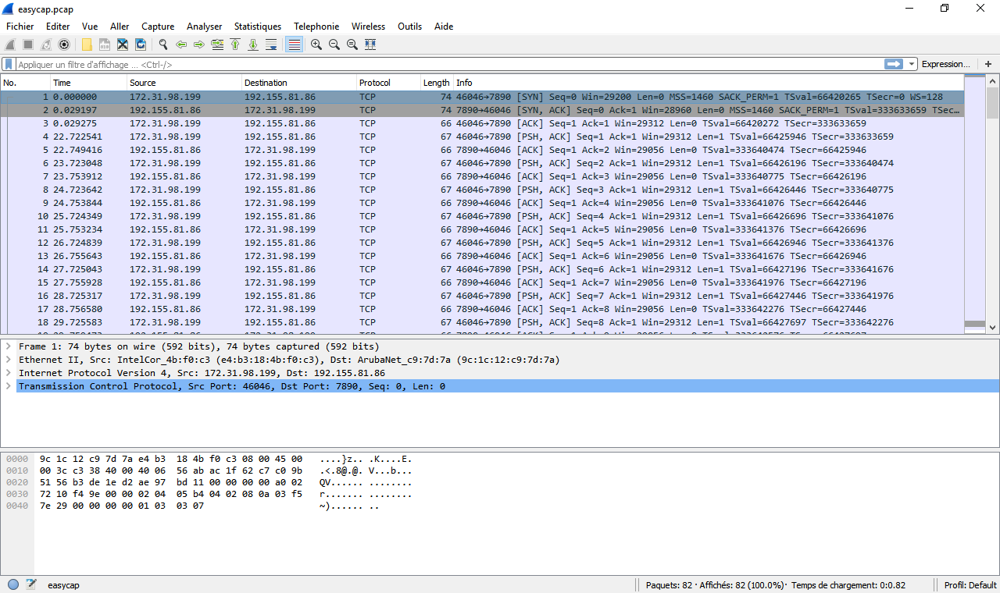
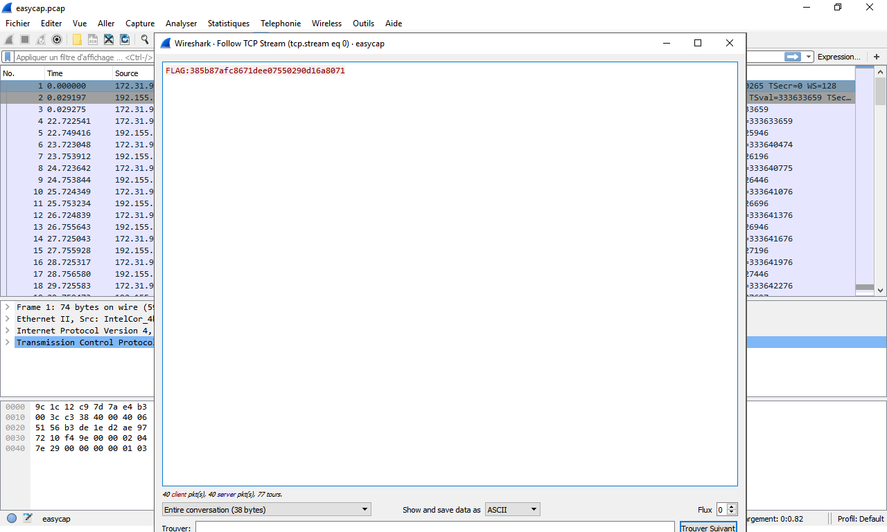

Challenge: Easycap |
----------------------------------------
Category: Forensic |
----------------------------------------
40 points |
----------------------------------------


```
Description:

Can you get the flag from the packet capture?

File: easycap.pcap
```



```
Click and Follow Flux TCP (Follow TCP stream)
```



```
FLAG:385b87afc8671dee07550290d16a8071
```
