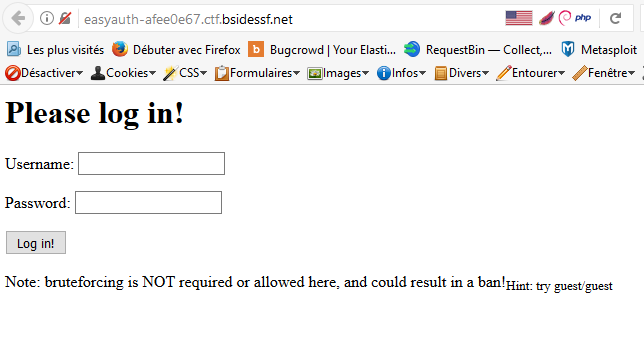
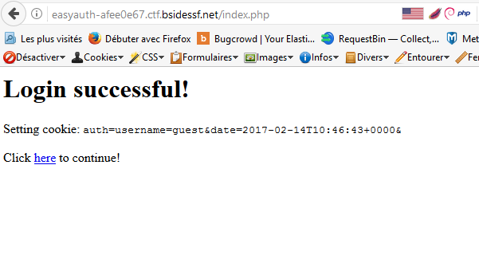
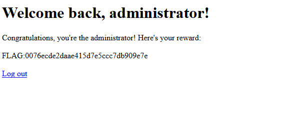

Challenge: Easyauth |
----------------------------------------
Category: Web |
----------------------------------------
30 points |
----------------------------------------

```
Description:

Can you gain admin access to this site?
http://easyauth-afee0e67.ctf.bsidessf.net

file: easyauth.php

```

``` php

<?php
  require_once('./auth.php');

  if(isset($_GET['action']) && $_GET['action'] === 'logout') {
    setcookie('auth', '');
    header('Location: index.php');
    exit(0);
  }

  if(isset($_POST['username'])) {
    # Do pagey stuff
    if(is_valid($_POST['username'], $_POST['password'])) {
      # Create the cookie
      $cookie = 'username=' . $_POST['username'] . '&';
      $cookie .= 'date=' . date(DATE_ISO8601) . '&';

      setcookie('auth', $cookie);
      print "<h1>Login successful!</h1>\n";
      print "<p>Setting cookie: <tt>auth=$cookie</tt></p>\n";
    } else {
      print "<h1>Username or password was incorrect!</h1>\n";
    }
    print "<p>Click <a href='index.php'>here</a> to continue!</p>\n";
    exit(0);
  }

  if(!isset($_COOKIE['auth'])) {
    require_once('./login_form.php');
    exit(0);
  }
  $cookie = $_COOKIE['auth'];

  $pairs = explode('&', $cookie);
  $args = array();
  foreach($pairs as $pair) {
    if(!strpos($pair, '='))
      continue;

    list($name, $value) = explode('=', $pair, 2);
    $args[$name] = $value;
  }
  $username = $args['username'];

  print "<h1>Welcome back, $username!</h1>\n";
  if($username == 'administrator') {
    print "<p>Congratulations, you're the administrator! Here's your reward:</p>\n";
    print "<p>" . FLAG . "</p>\n";
  } else {
    print "<p>It's cool that you logged in, but unfortunately we can only give the flag to 'administrator'. :(</p>\n";
  }
  print "<p><a href='/index.php?action=logout'>Log out</a></p>\n";
?>
```
We know now that we need to log in as administrator !!!
Connect to site.



```
Hint: Try guest/guest
We connect to site with credentials guest:guest

```



We see the cookie appear.
I modify it with the plugin Cookie+ Manager de Firefox. Knowing that we have to be logged into administrator.


```
Host:                 easyauth-afee0e67.ctf.bsidessf.net
Name:                 auth
Path:                 /
Content:              username%3Dadministrator%26date%3D2017-02-13T08%3A35%3A43%2B0000%26
Content raw:          username%3Dadministrator%26date%3D2017-02-13T08%3A35%3A43%2B0000%26
Expires:              À la fin de la session
Expires raw:          0
Send for:             Tout type de connexion
Send for raw:         false
Created:              Monday, February 13, 2017 9:34:50 AM
Created raw:          1486974889695000
Last accessed:        Monday, February 13, 2017 9:35:29 AM
Last accessed raw:    1486974929269000
HTTP only:            No
HTTP only raw:        false
This domain only:     No
This domain only raw: false
Policy:               no information available
Policy raw:           0
Status:               no information available
Status raw:           0
---
```

Then reload the page by logging in as administrator.



```
FLAG:0076ecde2daae415d7e5ccc7db909e7e
```

