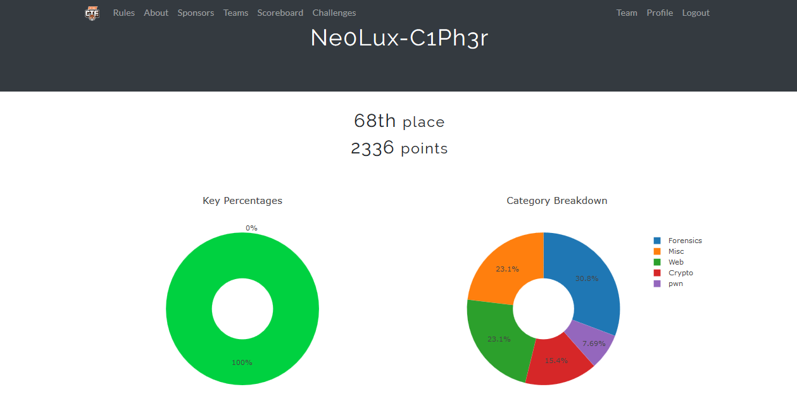

<a href="https://github.com/Ne0Lux-C1Ph3r/WRITE-UP/blob/master/RITSEC_CTF_2018/CRYPTO/index.md">Cryptography</a>

<a href="https://github.com/Ne0Lux-C1Ph3r/WRITE-UP/blob/master/RITSEC_CTF_2018/FORENSIC/index.md">Forensic</a>

<a href="https://github.com/Ne0Lux-C1Ph3r/WRITE-UP/blob/master/RITSEC_CTF_2018/MISC/index.md">Misc</a>

<a href="https://github.com/Ne0Lux-C1Ph3r/WRITE-UP/blob/master/RITSEC_CTF_2018/PWN/index.md">Exploitation Binary</a>

<a href="https://github.com/Ne0Lux-C1Ph3r/WRITE-UP/blob/master/RITSEC_CTF_2018/WEB/index.md">Exploitation Web</a>
 
