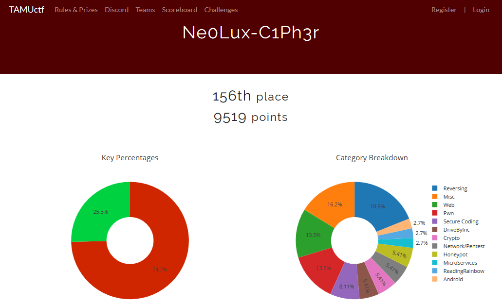

<p align="center"></p>

``` shell

```

<p align="center"></p>


<p align="left"><a href="https://github.com/Ne0Lux-C1Ph3r/WRITE-UP/blob/master/TAMUctf2019/Android/index.md">Android</a></p> 
<p align="left"><a href="https://github.com/Ne0Lux-C1Ph3r/WRITE-UP/blob/master/TAMUctf2019/Crypto/index.md">Crypto</a></p>
<p align="left"><a href="https://github.com/Ne0Lux-C1Ph3r/WRITE-UP/blob/master/TAMUctf2019/DriveByInc/index.md">DriveByInc</a></p> 
<p align="left"><a href="https://github.com/Ne0Lux-C1Ph3r/WRITE-UP/blob/master/TAMUctf2019/Honeypot/index.md">Honeypot</a></p>
<p align="left"><a href="https://github.com/Ne0Lux-C1Ph3r/WRITE-UP/blob/master/TAMUctf2019/MicroServices/index.md">MicroServices</a></p> 
<p align="left"><a href="https://github.com/Ne0Lux-C1Ph3r/WRITE-UP/blob/master/TAMUctf2019/Misc/index.md">Misc</a></p>
<p align="left"><a href="https://github.com/Ne0Lux-C1Ph3r/WRITE-UP/blob/master/TAMUctf2019/Network-Pentest/index.md">Network-Pentest</a></p> 
<p align="left"><a href="https://github.com/Ne0Lux-C1Ph3r/WRITE-UP/blob/master/TAMUctf2019/Pwn/index.md">Pwn</a></p>
<p align="left"><a href="https://github.com/Ne0Lux-C1Ph3r/WRITE-UP/blob/master/TAMUctf2019/ReadingRainbow/index.md">ReadingRainbow</a></p>
<p align="left"><a href="https://github.com/Ne0Lux-C1Ph3r/WRITE-UP/blob/master/TAMUctf2019/Reversing/index.md">Reversing</a></p> 
<p align="left"><a href="https://github.com/Ne0Lux-C1Ph3r/WRITE-UP/blob/master/TAMUctf2019/Secure Coding/index.md">Secure Coding</a></p>
<p align="left"><a href="https://github.com/Ne0Lux-C1Ph3r/WRITE-UP/blob/master/TAMUctf2019/Web/index.md">Web</a></p>

