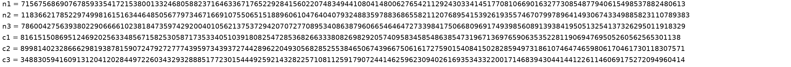

<h1 align="center">Cryptography</h1>


<h3>Polybius 70 points</h3>

Polybius is hosting a party, and you’re invited. He gave you his number; be there or be square!
Note, this flag is not in the usual flag format.

Download the file below: polybius.txt

``` shell
413532551224514444425111431524443435454523114523114314
```

<p align="center"></img></p>

``` shell
For this challenge, i use the site DCODE.

Flag: POLYBIUSSQUAREISNOTTHATHARD
```

<h3>Classic 80 points</h3>

My friend told me this "was a classic", but these letters and numbers don't make any sense to me. I didn't know this would be a factor in our friendship!

Download the file below: classic.txt

``` python
For this challenge, i use python with libnum and yafu for the factorisation of n.

n = 77627938360345301510724699969247652387657633828943576274039402978346703944383

e = 65537

c = 62899945974090753231979111677615029855602721049941681356856158761811378918268

"""
Factorisation with YAFU
starting SIQS on c77: 77627938360345301510724699969247652387657633828943576274039402978346703944383

==== sieving in progress (1 thread):   36224 relations needed ====
====           Press ctrl-c to abort and save state           ====
36103 rels found: 18466 full + 17637 from 187841 partial, (873.70 rels/sec)

SIQS elapsed time = 239.6736 seconds.
Total factoring time = 300.7092 seconds


***factors found***

P39 = 269967471399519356371128763174813106357
P39 = 287545525236502653835798598413374134819

ans = 1
"""

p = 269967471399519356371128763174813106357
q = 287545525236502653835798598413374134819

#!/usr/bin/env python
import libnum

n=p*q
phi=(p-1)*(q-1)
d = libnum.modular.invmod(e, phi)
print libnum.n2s(pow(c, d, n))

# LLS{just_another_rsa_chal}

Flag: LLS{just_another_rsa_chal}
```

<h3>Hot Dog 100 points</h3>

This isn't a problem with the grill.

Download the file below: hot_dog.txt

``` python
For this challenge, i use python3 and RsaCtfTool.


python3 RsaCtfTool.py -n 609983533322177402468580314139090006939877955334245068261469677806169434040069069770928535701086364941983428090933795745853896746458472620457491993499511798536747668197186857850887990812746855062415626715645223089415186093589721763366994454776521466115355580659841153428179997121984448771910872629371808169183 -e 387825392787200906676631198961098070912332865442137539919413714790310139653713077586557654409565459752133439009280843965856789151962860193830258244424149230046832475959852771134503754778007132465468717789936602755336332984790622132641288576440161244396963980583318569320681953570111708877198371377792396775817 --uncipher 387550614803874258991642724003284418859467464692188062983793173435868573346772557240137839436544557982321847802344313679589173157662615464542092163712541321351682014606383820947825480748404154232812314611063946877021201178164920650694457922409859337200682155636299936841054496931525597635432090165889554207685 --verbose
[*] Performing hastads attack.
[*] Performing prime_n attack.
[*] Performing factordb attack.
[*] Performing pastctfprimes attack.
[*] Loaded 71 primes
[*] Performing mersenne_primes attack.
[*] Performing noveltyprimes attack.
[*] Performing smallq attack.
[*] Performing wiener attack.
[+] Clear text : b'\x00\x00\x00\x00\x00\x00\x00\x00\x00\x00\x00\x00\x00\x00\x00\x00\x00\x00\x00\x00\x00\x00\x00\x00\x00\x00\x00\x00\x00\x00\x00\x00\x00\x00\x00\x00\x00\x00\x00\x00\x00\x00\x00\x00\x00\x00\x00\x00\x00\x00\x00\x00\x00\x00\x00\x00\x00\x00\x00\x00\x00\x00\x00\x00\x00\x00\x00\x00\x00\x00\x00\x00\x00\x00\x00\x00\x00\x00\x00\x00\x00\x00\x00\x00\x00\x00\x00\x00\x00\x00LLS{looks_like_weiners_on_the_barbecue}'

Flag: LLS{looks_like_weiners_on_the_barbecue}
```

<h3>Old Monitor 135 points</h3>

I have this old CRT monitor that I use for my desktop computer. It crashed on me and spit out all these weird numbers…

Download the file below: old_monitor.png

``` shell
For this challenge, i use gocr and python.
```

<p align="center"></img></p>

``` python

N1 = 7156756869076785933541721538001332468058823716463367176522928415602207483494410804148006276542112924303341451770810669016327730854877940615498537882480613
N2 = 11836621785229749981615163446485056779734671669107550651518896061047640407932488359788368655821120768954153926193557467079978964149306743349885823110789383
N3 = 7860042756393802290666610238184735974292004010562137537294207072770895340863879606654646472733984175066809691749398560891393841950513254137326295011918329
C1 = 816151508695124692025633485671582530587173533405103918082547285368266333808269829205740958345854863854731967136976590635352281190694769505260562565301138
C2 = 8998140232866629819387815907247927277743959734393727442896220493056828525538465067439667506161727590154084150282859497318610746474659806170461730118307571
C3 = 3488305941609131204120284497226034329328885177230154449259214328225710811259179072441462596230940261693534332200171468394304414412261146069175272094960414

e=3
def chinese_remainder(n, a):
    sum = 0
    prod = reduce(lambda a, b: a*b, n)
    for n_i, a_i in zip(n, a):
        p = prod / n_i
        sum += a_i * mul_inv(p, n_i) * p
    return sum % prod

def mul_inv(a, b):
    b0 = b
    x0, x1 = 0, 1
    if b == 1: return 1
    while a > 1:
        q = a / b
        a, b = b, a%b
        x0, x1 = x1 - q * x0, x0
    if x1 < 0: x1 += b0
    return x1

def find_invpow(x,n):
    """Finds the integer component of the n'th root of x,
    an integer such that y ** n <= x < (y + 1) ** n.
    """
    high = 1
    while high ** n < x:
        high *= 2
    low = high/2
    while low < high:
        mid = (low + high) // 2
        if low < mid and mid**n < x:
            low = mid
        elif high > mid and mid**n > x:
            high = mid
        else:
            return mid
    return mid + 1

flag_cubed=chinese_remainder([N1,N2,N3],[C1,C2,C3])
flag=find_invpow(flag_cubed,3)

print "flag: ",hex(flag)[2:-1].decode("hex")

# flag:  LLS{the_chinese_remainder_theorem_is_so_cool}

Flag: LLS{the_chinese_remainder_theorem_is_so_cool}
```


<p align="left"><a href="https://github.com/Ne0Lux-C1Ph3r/WRITE-UP/blob/master/VirSecCon CTF/index.md">Return to the main menu</a></p>

