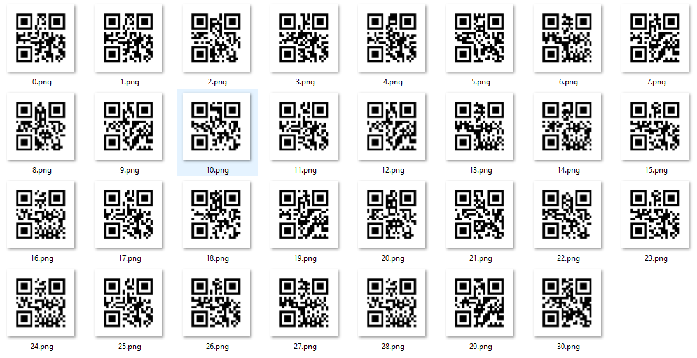
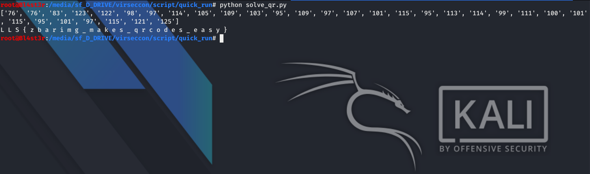
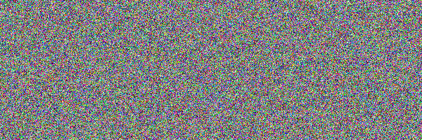
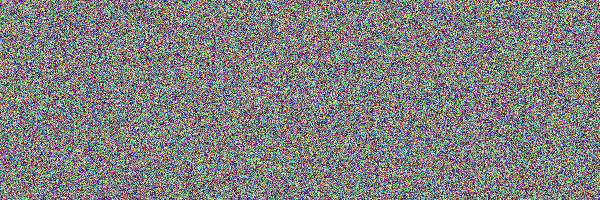
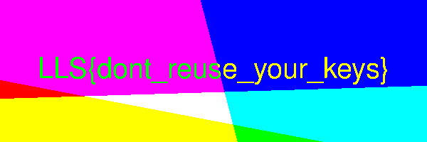

<h1 align="center">Script</h1>


<h3>Quick Run 75 points</h3>

You gotta go fast!

Download the files below: quick_run.zip

<p align="center"></img></p>

<p align="center"></img></p>

``` shell
For this challenge, i use python and zbarimg.
```

``` python
import os
import re

flag = []

for i in range(31):
	number = os.popen("zbarimg -q "+str(i)+".png").read()
	flag.append(''.join(re.findall(r"[-+]?\d+", number)))
print flag

for code in flag:
	print "".join(chr(int(code))),
  
  
# Flag: LLS{zbarimg_makes_qrcodes_easy}
```

<h3>2xPAD 100 points</h3>

The latest and greatest encryption scheme, “two-time pad” is twice as secure as one time pads. Check it out!

Download the files below: encrypted_one.png and encrypted_two.png

<p align="center"></img></p>

<p align="center"></img></p>

<p align="center"></img></p>

``` shell
For this challenge, i use convert of imagemagick.
convert encrypted_one.png encrypted_two.png -fx "((255-u)&v)|(u&(255-v))" flag_xor.png

Flag: LLS{dont_reuse_your_keys}
```

<p align="left"><a href="https://github.com/Ne0Lux-C1Ph3r/WRITE-UP/blob/master/VirSecCon CTF/index.md">Return to the main menu</a></p>


