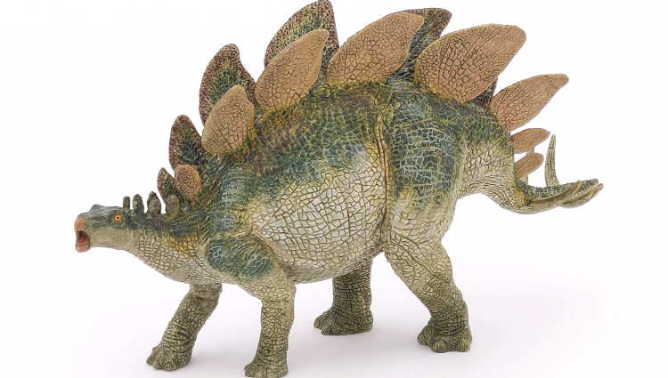
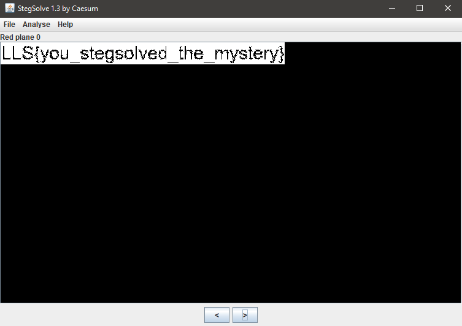
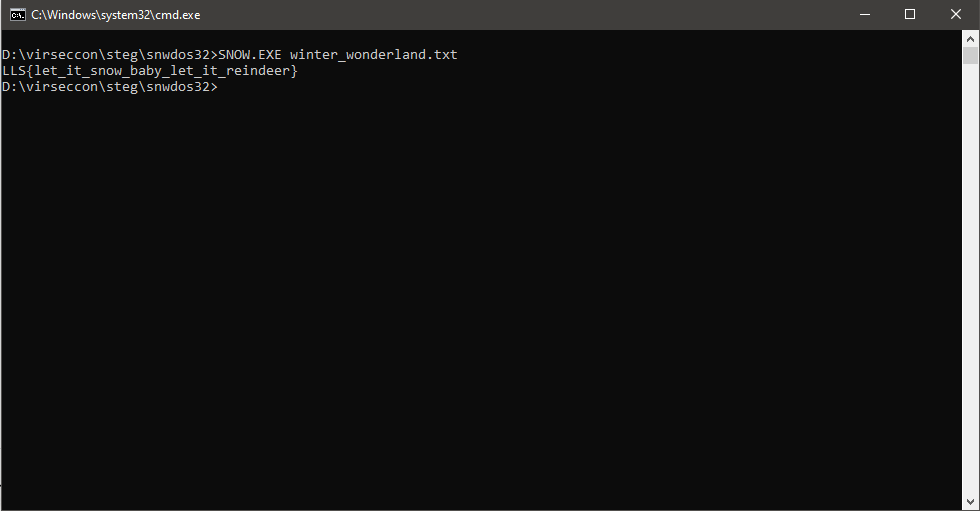
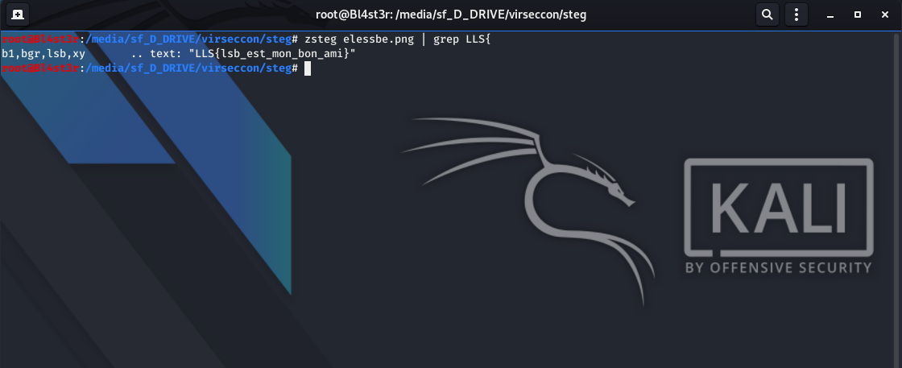

<h1 align="center">Steganography</h1>


<h3>Stegosaurus 70 points</h3>

Scientists are struggling with a new mystery: we thought the dinosaurs were gone, but this one has returned! Hmmm... can you solve this mystery?
Download the file below: stegosaurus.png

<p align="center"></img></p>

<p align="center"></img></p>

``` shell
For this challenge, i use stegsolve with red plane 0.

Flag: LLS{you_stegsolved_the_mystery}
```


<h3>Winter Wonderland 80 points</h3>

It’s the holiday season! But hmm… they must be hiding something under all that cheer!
Download the file below: winter_wonderland.txt

<p align="center"></img></p>

``` shell
For this challenge, i use snow.
SNOW.EXE winter_wonderland.txt

Flag: LLS{let_it_snow_baby_let_it_reindeer}
```


<h3>Elessbe 80 points</h3>

Ah, bonjour mon bon ami! Bienvenue à la capture du drapeau! J’ai entendu dire que vous étiez fan de la stéganographie! Avez-vous déjà entendu parler d’un outil appelé zsteg?
Download the file below: elessbe.png

<p align="center"></img></p>

<p align="center"></img></p>

``` shell
For this challenge, i use zsteg.

Flag: LLS{lsb_est_mon_bon_ami} 
```

<p align="left"><a href="https://github.com/Ne0Lux-C1Ph3r/WRITE-UP/blob/master/VirSecCon CTF/index.md">Return to the main menu</a></p>
