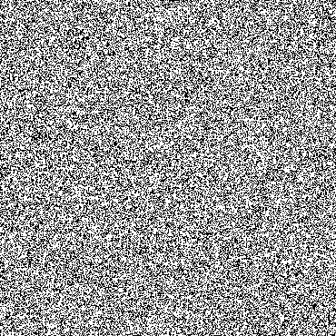
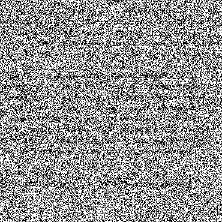
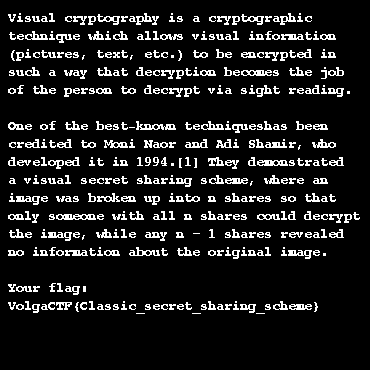

Challenge: VC
----------------------------------------
Category: Cryptography 
----------------------------------------
50 points 
----------------------------------------

```
Description:

There are files A.png and B.png. But where's the flag?

Files: A.png and B.png
```





``` shell
convert A.png B.png -fx "((255-u)&v)|(u&(255-v))" image_xor.png
```



VolgaCTF{Classic_secret_sharing_scheme}
