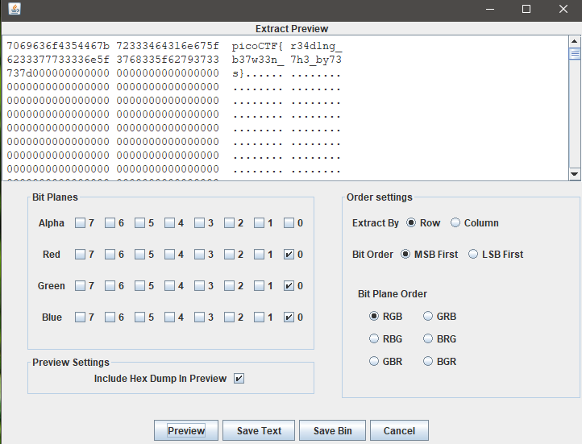
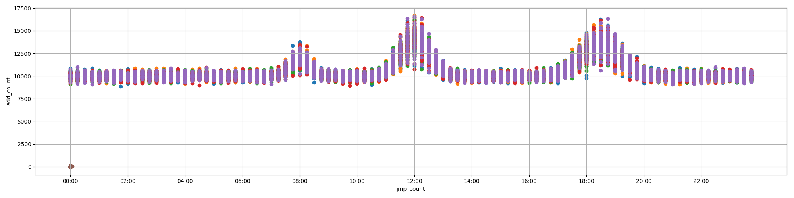
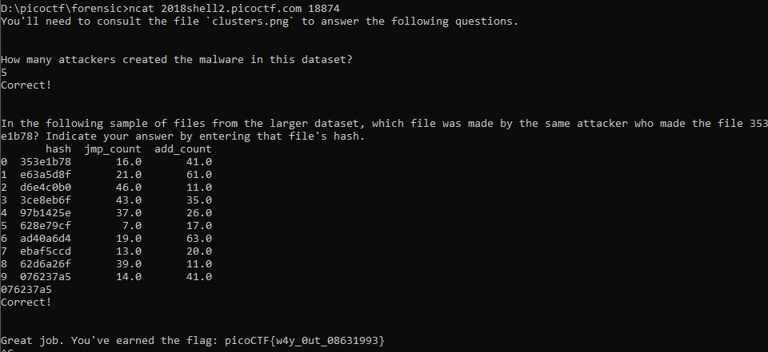

<h1 align="center">Forensics</h1>


<h3>Forensics Warmup 1 - Points: 50</h3>
Can you unzip this file for me and retreive the flag?

</img>

<h3>Forensics Warmup 2 - Points: 50</h3>
Hmm for some reason I can't open this PNG? Any ideas? 

</img>

<h3>Desrouleaux - Points: 150</h3>
Our network administrator is having some trouble handling the tickets for all of of our incidents. Can you help him out by answering all the questions? Connect with nc 2018shell2.picoctf.com 40952. incidents.json 

``` shell
Flag: {
    "tickets": [
        {
            "ticket_id": 0,
            "timestamp": "2017/05/04 23:45:18",
            "file_hash": "738d40a4afcb15f4",
            "src_ip": "9.94.163.45",
            "dst_ip": "83.137.118.6"
        },
        {
            "ticket_id": 1,
            "timestamp": "2016/12/19 13:05:51",
            "file_hash": "4d7fe02f1f85d0d8",
            "src_ip": "9.94.163.45",
            "dst_ip": "18.224.167.45"
        },
        {
            "ticket_id": 2,
            "timestamp": "2017/03/05 07:13:56",
            "file_hash": "1718ac17182e8f76",
            "src_ip": "43.250.172.185",
            "dst_ip": "18.224.167.45"
        },
        {
            "ticket_id": 3,
            "timestamp": "2015/01/03 22:22:22",
            "file_hash": "9993cabd2e9186c6",
            "src_ip": "60.214.214.112",
            "dst_ip": "18.224.167.45"
        },
        {
            "ticket_id": 4,
            "timestamp": "2017/03/25 23:54:23",
            "file_hash": "738d40a4afcb15f4",
            "src_ip": "43.250.172.185",
            "dst_ip": "72.68.87.202"
        },
        {
            "ticket_id": 5,
            "timestamp": "2016/12/16 02:36:49",
            "file_hash": "8e2e448afdf47e87",
            "src_ip": "9.94.163.45",
            "dst_ip": "59.173.193.36"
        },
        {
            "ticket_id": 6,
            "timestamp": "2015/04/29 00:26:41",
            "file_hash": "1718ac17182e8f76",
            "src_ip": "221.111.141.62",
            "dst_ip": "115.212.228.187"
        },
        {
            "ticket_id": 7,
            "timestamp": "2016/01/10 07:40:01",
            "file_hash": "4d7fe02f1f85d0d8",
            "src_ip": "221.111.141.62",
            "dst_ip": "18.224.167.45"
        },
        {
            "ticket_id": 8,
            "timestamp": "2017/09/03 01:05:32",
            "file_hash": "638dc9310d5017ed",
            "src_ip": "43.250.172.185",
            "dst_ip": "57.83.125.204"
        },
        {
            "ticket_id": 9,
            "timestamp": "2015/12/05 22:29:00",
            "file_hash": "88e5f3bc7cdc1ab0",
            "src_ip": "60.214.214.112",
            "dst_ip": "83.137.118.6"
        }
    ]
}


nc 2018shell2.picoctf.com 40952
You'll need to consult the file `incidents.json` to answer the following questions.

What is the most common source IP address? If there is more than one IP address that is the most common, you may give any of the most common ones.
9.94.163.45
Correct!

How many unique destination IP addresses were targeted by the source IP address 9.94.163.45?
3
Correct!

What is the average number of unique destination IP addresses that were sent a file with the same hash? Your answer needs to be correct to 2 decimal places.
1.28
Correct!

Great job. You've earned the flag: picoCTF{J4y_s0n_d3rUUUULo_b6cacd6c}
```

<h3>Reading Between the Eyes - Points: 150</h3>
Stego-Saurus hid a message for you in this image, can you retreive it? 

</img>

``` shell
Flag: zsteg -a husky.png | grep picoCTF{
                    or
```
</img>

<h3>Recovering From the Snap - Points: 150</h3>
There used to be a bunch of animals here, what did Dr. Xernon do to them? 

``` shell
Flag: Use binwalk
```
</img>

<h3>admin panel - Points: 150</h3>
We captured some traffic logging into the admin panel, can you find the password? 

``` shell
Flag: strings data.pcap | grep picoCTF{
user=admin&password=picoCTF{n0ts3cur3_b186631d}
```

<h3>hex editor - Points: 150</h3>
This cat has a secret to teach you. You can also find the file in /problems/hex-editor_4_0a7282b29fa47d68c3e2917a5a0d726b on the shell server. 

</img>
``` shell
Flag: strings hex_editor.jpg | grep picoCTF{
Your flag is: "picoCTF{and_thats_how_u_edit_hex_kittos_dF817ec5}"
```

<h3>Truly an Artist - Points: 200</h3>
Can you help us find the flag in this Meta-Material? You can also find the file in /problems/truly-an-artist_2_61a3ed7216130ab1c2b2872eeda81348.

</img>

``` shell
Flag: strings 2018.png | grep picoCTF{
picoCTF{look_in_image_7e31505f}
```

<h3>now you don't - Points: 200</h3>
We heard that there is something hidden in this picture. Can you find it? 

</img>
``` shell
Flag: Stegsolve with random colour map
```
</img>


<h3>What's My Name? - Points: 250</h3>
Say my name, say my name.

``` shell
Flag: strings myname.pcap | grep picoCTF{
picoCTF{w4lt3r_wh1t3_ddfad6f8f4255adc73e862e3cebeee9d}
```

<h3>Malware Shops - Points: 400</h3>
There has been some malware detected, can you help with the analysis? More info here. Connect with nc 2018shell2.picoctf.com 18874. 

</img>

</img>


<h3>LoadSomeBits - Points: 550</h3>
Can you find the flag encoded inside this image? You can also find the file in /problems/loadsomebits_3_8933ebe9085168b1e0bbb07884c2231f on the shell server.

</img>
``` shell
Flag: data = bytearray(open('pico2018-special-logo.bmp', 'rb').read())
lsb = ''
for byte in data[54:]:
    lsb += str(byte & 1)
lsb_bytes = [lsb[i:i+8] for i in range(0, len(lsb), 8)]
out = ''
for byte in lsb_bytes:
    out += chr(int(byte, 2))
print(out)
# picoCTF{st0r3d_iN_tH3_l345t_s1gn1f1c4nT_b1t5_449088860}
```
