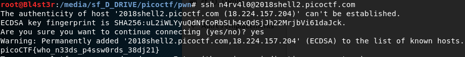

<h1 align="center">General Skills</h1>


<h3>General Warmup 1 - Points: 50</h3>
If I told you your grade was 0x41 in hexadecimal, what would it be in ASCII?

``` shell
Flag: picoCTF{A}
```

<h3>General Warmup 2 - Points: 50</h3>
Can you convert the number 27 (base 10) to binary (base 2)? 

``` shell
Flag: picoCTF{11011}
```

<h3>General Warmup 3 - Points: 50</h3>
What is 0x3D (base 16) in decimal (base 10). 

``` shell
Flag: picoCTF{61}
```

<h3>Resources - Points: 50</h3>
We put together a bunch of resources to help you out on our website! If you go over there, you might even find a flag! https://picoctf.com/resources (link)

``` shell
Flag: Thanks for reading the resources page! Here’s a flag for your time: picoCTF{xiexie_ni_lai_zheli}
```

<h3>grep 1 - Points: 75</h3>
Can you find the flag in file? This would be really obnoxious to look through by hand, see if you can find a faster way. You can also find the file in /problems/grep-1_1_35b9930ca897512a4d00b43d26eac73d on the shell server.

``` shell
Flag: strings file | grep picoCTF{
picoCTF{grep_and_you_will_find_c709fa94}
```

<h3>net cat - Points: 75</h3>
Using netcat (nc) will be a necessity throughout your adventure. Can you connect to 2018shell2.picoctf.com at port 49387 to get the flag?

``` shell
Flag: nc 2018shell1.picoctf.com 49387
That wasn't so hard was it?
picoCTF{NEtcat_iS_a_NEcESSiTy_8b6a1fbc}
```

<h3>strings - Points: 100</h3>
Can you find the flag in this file without actually running it? You can also find the file in /problems/strings_1_c7bac958dd6a4b695dc72446d8014f59 on the shell server.

``` shell
Flag: strings strings | grep picoCTF{
picoCTF{sTrIngS_sAVeS_Time_d3ffa29c}
```

<h3>pipe - Points: 110</h3>
During your adventure, you will likely encounter a situation where you need to process data that you receive over the network rather than through a file. Can you find a way to save the output from this program and search for the flag? Connect with 2018shell2.picoctf.com 37542.

``` shell
Flag: nc 2018shell2.picoctf.com 37542 | grep picoCTF{
picoCTF{almost_like_mario_a6975cdb}
```

<h3>grep 2 - Points: 125</h3>
This one is a little bit harder. Can you find the flag in /problems/grep-2_4_06c2058761f24267033e7ca6ff9d9144/files on the shell server? Remember, grep is your friend.

``` shell
Flag: n4rv4l0@pico-2018-shell-2:/problems/grep-2_4_06c2058761f24267033e7ca6ff9d9144/files$ find . -type f -print0 | 
xargs -0 grep "picoCTF"
./files2/file3:picoCTF{grep_r_and_you_will_find_036bbb25}
```

<h3>environ - Points: 150</h3>
Sometimes you have to configure environment variables before executing a program. Can you find the flag we've hidden in an environment variable on the shell server?

``` shell
Flag: n4rv4l0@pico-2018-shell-2:~$ set | grep picoCTF{                                                              
SECRET_FLAG='picoCTF{eNv1r0nM3nT_v4r14Bl3_fL4g_3758492}'
```

<h3>ssh-keyz - Points: 150</h3>
As nice as it is to use our webshell, sometimes its helpful to connect directly to our machine. To do so, please add your own public key to ~/.ssh/authorized_keys, using the webshell. The flag is in the ssh banner which will be displayed when you login remotely with ssh to with your username.

``` shell
Flag: /tmp is not allowed, add my own public key to ~/.ssh/authorized_keys.
```
</img>

<h3>what base is this? - Points: 200</h3>
To be successful on your mission, you must be able read data represented in different ways, such as hexadecimal or binary. Can you get the flag from this program to prove you are ready? Connect with nc 2018shell2.picoctf.com 15853.

``` shell
Flag: nc 2018shell2.picoctf.com 15853
We are going to start at the very beginning and make sure you understand how data is stored.
phone
Please give me the 01110000 01101000 01101111 01101110 01100101 as a word.
To make things interesting, you have 30 seconds.
Input:
phone
Please give me the 706c7567 as a word.
Input:
plug
Please give me the  143 157 155 160 165 164 145 162 as a word.
Input:
computer
You got it! You're super quick!
Flag: picoCTF{delusions_about_finding_values_3cc386de}
```

<h3>you can't see me - Points: 200</h3>
'...reading transmission... Y.O.U. .C.A.N.'.T. .S.E.E. .M.E. ...transmission ended...' Maybe something lies in /problems/you-can-t-see-me_2_cfb71908d8368e3062423b45959784aa.

``` shell
Flag: n4rv4l0@pico-2018-shell-2:/problems/you-can-t-see-me_2_cfb71908d8368e3062423b45959784aa$ find . -type f -print
0 | xargs -0 grep "picoCTF"
picoCTF{j0hn_c3na_paparapaaaaaaa_paparapaaaaaa_093d6aff}
```

<h3>absolutely relative - Points: 250</h3>
In a filesystem, everything is relative ¯\_(ツ)_/¯. Can you find a way to get a flag from this program? You can find it in /problems/absolutely-relative_0_d4f0f1c47f503378c4bb81981a80a9b6 on the shell server. Source.

``` shell
#include <stdio.h>
#include <string.h>

#define yes_len 3
const char *yes = "yes";

int main()
{
    char flag[99];
    char permission[10];
    int i;
    FILE * file;


    file = fopen("/problems/absolutely-relative_0_d4f0f1c47f503378c4bb81981a80a9b6/flag.txt" , "r");
    if (file) {
    	while (fscanf(file, "%s", flag)!=EOF)
    	fclose(file);
    }   
	
    file = fopen( "./permission.txt" , "r");
    if (file) {
    	for (i = 0; i < 5; i++){
            fscanf(file, "%s", permission);
        }
        permission[5] = '\0';
        fclose(file);
    }
    
    if (!strncmp(permission, yes, yes_len)) {
        printf("You have the write permissions.\n%s\n", flag);
    } else {
        printf("You do not have sufficient permissions to view the flag.\n");
    }
    
    return 0;
}


Flag: n4rv4l0@pico-2018-shell-2:~$ echo "yes" >> permission.txt
n4rv4l0@pico-2018-shell-2:/problems/absolutely-relative_0_d4f0f1c47f503378c4bb81981a80a9b6$ ./absolutely-relative
You have the write permissions.                                                                               
picoCTF{3v3r1ng_1$_r3l3t1v3_befc0ce1}
```

<h3>in out error - Points: 275</h3>
Can you utlize stdin, stdout, and stderr to get the flag from this program? You can also find it in /problems/in-out-error_1_24ebc7186086f0f9a710de008628c561 on the shell server 

``` shell
In IDA pro:

char *phrase = "Please may I have the flag?"; // idb

v10 = __readfsqword(0x28u);
  setvbuf(stdout, 0LL, 2, 0LL);
  setvbuf(stderr, 0LL, 2, 0LL);
  stream = fopen("flag.txt", "r");
  if ( stream )
  {
    while ( (unsigned int)__isoc99_fscanf(stream, "%s", s) != -1 )
      fclose(stream);
  }
  v5 = strlen(s);
  v6 = strlen(output);
  puts(
    "Hey There!\n"
    "If you want the flag you have to ask nicely for it.\n"
    "Enter the phrase \"Please may I have the flag?\" into stdin and you shall receive.");
  fgets(&s1, 28, stdin);
if ( !strcasecmp(&s1, phrase) )
  {
    puts("Thank you for asking so nicely!");
    for ( i = 0; i < v6; ++i )
    {
      fputc(output[i], stdout);
      fputc(s[i % v5], stderr);
    }
    putchar(10);
  }
  else
  {
    puts("You didn't ask correctly :(\nNo flag for you");
  }
  return 0;
}

Flag: n4rv4l0@pico-2018-shell-2:/problems/in-out-error_1_24ebc7186086f0f9a710de008628c561$ echo "Please may I have the flag?" | ./in-out-error | grep picoCTF{
picoCTF{p1p1ng_1S_4_7h1ng_7b9360ca}
```

<h3>learn gdb - Points: 300</h3>
Using a debugging tool will be extremely useful on your missions. Can you run this program in gdb and find the flag? You can find the file in /problems/learn-gdb_4_2ca642e0eb4e21999bb1e6650342e545 on the shell server.

``` shell
Flag: int __cdecl main(int argc, const char **argv, const char **envp)
{
  setvbuf(stdout, 0LL, 2, 0LL);
  puts("Decrypting the Flag into global variable 'flag_buf'");
  decrypt_flag();
  puts("Finished Reading Flag into global variable 'flag_buf'. Exiting.");
  return 0;
}

picoCTF{gDb_iS_sUp3r_u53fuL_9fa6c71d}

```


```
