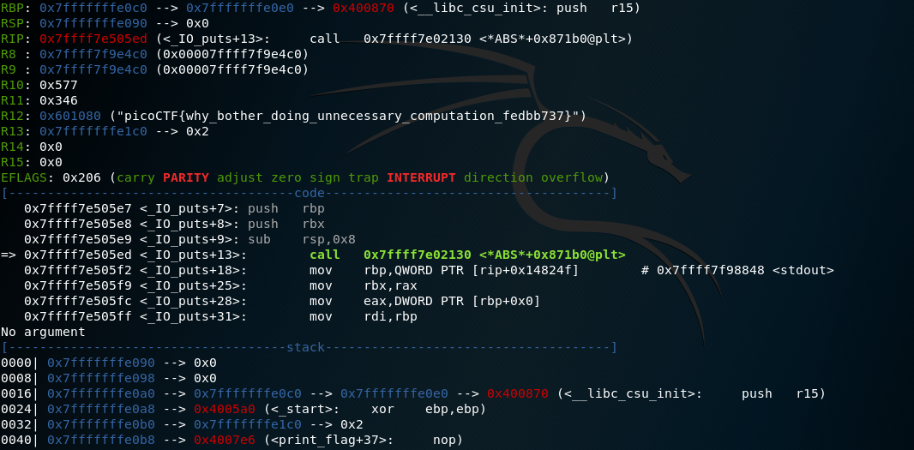

<h1 align="center">Reversing</h1>


<h3>Reversing Warmup 1 - Points: 50</h3>
Throughout your journey you will have to run many programs. Can you navigate to /problems/reversing-warmup-1_1_b416a2d0694c871d8728d8268d84ac5c on the shell server and run this program to retreive the flag?

``` shell
Flag: strings run | grep picoCTF{
picoCTF{welc0m3_t0_r3VeRs1nG}
```

<h3>Reversing Warmup 2 - Points: 50</h3>
Can you decode the following string dGg0dF93NHNfczFtcEwz from base64 format to ASCII? 

``` shell
Flag: picoCTF{th4t_w4s_s1mpL3}
```

<h3>assembly-0 - Points: 150</h3>
What does asm0(0xaa,0xf2) return? Submit the flag as a hexadecimal value (starting with '0x'). NOTE: Your submission for this question will NOT be in the normal flag format. Source located in the directory at /problems/assembly-0_2_485b2d48345b19addbeb06a36aabdc74. 

``` shell 
.intel_syntax noprefix
.bits 32
	
.global asm0

asm0:
	push	ebp
	mov	ebp,esp
	mov	eax,DWORD PTR [ebp+0x8]
	mov	ebx,DWORD PTR [ebp+0xc]
	mov	eax,ebx
	mov	esp,ebp
	pop	ebp	
	ret
  
 Flag: 0xf2 
```

<h3>be-quick-or-be-dead-1 - Points: 200</h3>
You find this when searching for some music, which leads you to be-quick-or-be-dead-1. Can you run it fast enough? You can also find the executable in /problems/be-quick-or-be-dead-1_1_d0d1dc1d01c7fd569eac77763d813c6f. 

``` shell
//----- (0000000000400696) ----------------------------------------------------
__int64 __fastcall decrypt_flag(int a1)
{
  __int64 result; // rax
  int v2; // [rsp+0h] [rbp-14h]
  unsigned int i; // [rsp+10h] [rbp-4h]

  v2 = a1;
  for ( i = 0; ; ++i )
  {
    result = i;
    if ( i > 0x39 )
      break;
    flag[i] ^= *((_BYTE *)&v2 + (signed int)i % 4);
    if ( (signed int)i % 4 == 3 )
      ++v2;
  }
  return result;
}

//----- (0000000000400706) ----------------------------------------------------
signed __int64 calculate_key()
{
  signed int v1; // [rsp+0h] [rbp-4h]

  v1 = 1959971734;
  do
    ++v1;
  while ( v1 != -375023828 );
  return 3919943468LL;
}

//----- (0000000000400723) ----------------------------------------------------
void __noreturn alarm_handler()
{
  puts("You need a faster machine. Bye bye.");
  exit(0);
}

//----- (0000000000400742) ----------------------------------------------------
unsigned int set_timer()
{
  if ( __sysv_signal(14, (__sighandler_t)alarm_handler) == (__sighandler_t)-1LL )
  {
    printf(
      "\n\nSomething went terribly wrong. \nPlease contact the admins with \"be-quick-or-be-dead-1.c:%d\".\n",
      59LL);
    exit(0);
  }
  return alarm(1u);
}

//----- (0000000000400796) ----------------------------------------------------
int get_key()
{
  puts("Calculating key...");
  key = calculate_key();
  return puts("Done calculating key");
}
// 6010C0: using guessed type int key;

//----- (00000000004007C1) ----------------------------------------------------
int print_flag()
{
  puts("Printing flag:");
  decrypt_flag(key);
  return puts(flag);
}
// 6010C0: using guessed type int key;

//----- (00000000004007E9) ----------------------------------------------------
int header()
{
  unsigned int i; // [rsp+Ch] [rbp-4h]

  puts("Be Quick Or Be Dead 1");
  for ( i = 0; i <= 0x14; ++i )
    putchar(61);
  return puts("\n");
}

//----- (0000000000400827) ----------------------------------------------------
int __cdecl main(int argc, const char **argv, const char **envp)
{
  header();
  set_timer();
  get_key();
  print_flag();
  return 0;
}
```
</img>

<h3>Radix's Terminal - Points: 400</h3>
Can you find the password to Radix's login? You can also find the executable in /problems/radix-s-terminal_1_35b3f86ea999e44d72e988ef4035e872? 

``` shell
//----- (0804851B) --------------------------------------------------------
int __cdecl check_password(char *a1)
              ...
for ( i = 0; mod[v18 % 3] > i; ++i )
    s1[n - 1 - i] = 61;
  return strncmp(s1, "cGljb0NURntiQXNFXzY0X2VOQ29EaU5nX2lTX0VBc1lfMTg3NTk3NDV9", n);
}

Flag: picoCTF{bAsE_64_eNCoDiNg_iS_EAsY_18759745}

```
