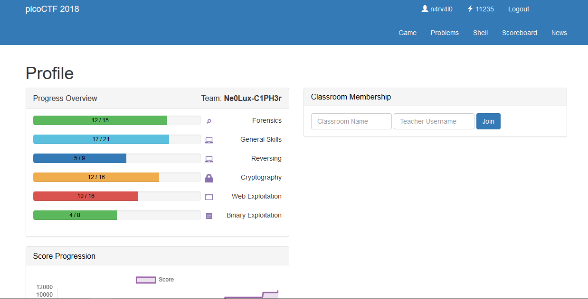

<p align="center"></p>

``` shell

```

<p align="center"></p>


<p align="left"><a href="https://github.com/Ne0Lux-C1Ph3r/WRITE-UP/blob/master/picoCTF2018/General%20Skills/index.md">General Skills</a></p> 
<p align="left"><a href="https://github.com/Ne0Lux-C1Ph3r/WRITE-UP/blob/master/picoCTF2018/Forensics/index.md">Forensics</a></p>
<p align="left"><a href="https://github.com/Ne0Lux-C1Ph3r/WRITE-UP/blob/master/picoCTF2018/Cryptography/index.md">Cryptography</a></p> 
<p align="left"><a href="https://github.com/Ne0Lux-C1Ph3r/WRITE-UP/blob/master/picoCTF2018/Reversing/index.md">Reversing</a></p>
<p align="left"><a href="https://github.com/Ne0Lux-C1Ph3r/WRITE-UP/blob/master/picoCTF2018/Binary%20exploitation/index.md">Binary Exploitation</a></p> 
<p align="left"><a href="https://github.com/Ne0Lux-C1Ph3r/WRITE-UP/blob/master/picoCTF2018/Web%20Exploitation/index.md">Web Exploitation</a></p>

