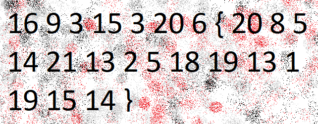
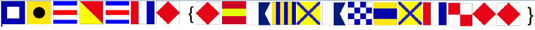

<h1 align="center">Cryptography</h1>


<h3>The Numbers - Points: 50</h3>
The numbers... what do they mean?

</img>

``` shell
Crypto alphabetic range

Flag: PICOCTF{THENUMBERSMASON}
```


<h3>13 - Points: 100</h3>
Cryptography can be easy, do you know what ROT13 is? cvpbPGS{abg_gbb_onq_bs_n_ceboyrz}

``` shell
Crypto ROT13 of Caesar

Flag: picoCTF{not_too_bad_of_a_problem}
```


<h3>Easy1 - Points: 100</h3>
The one time pad can be cryptographically secure, but not when you know the key. Can you solve this? We've given you the encrypted flag, key, and a table to help UFJKXQZQUNB with the key of SOLVECRYPTO. Can you use this table to solve it?. 

``` shell
Crypto Vigenere with key SOLVECRYPTO

Flag: picoCTF{CRYPTOISFUN}
```


<h3>caesar - Points: 100</h3>
Decrypt this message. You can find the ciphertext in /problems/caesar_0_22aa542fadadcc37b6ec6037c493ec9f on the shell server.

picoCTF{jyvzzpunaolybipjvunfzpthre}

``` shell
Crypto ROT7 of Caesar

Flag: picoCTF{crossingtherubicongysimakx}
```


<h3>Flags - Points: 200</h3>
What do the flags mean?

</img>

``` shell
Crypto Popham

Flag: PICOCTF{F1AG5AND5TUFF}
```


<h3>Mr-Worldwide - Points: 200</h3>
A musician left us a message. What's it mean?

picoCTF{(35.028309, 135.753082)(46.469391, 30.740883)(39.758949, -84.191605)(41.015137, 28.979530)(24.466667, 54.366669)(3.140853, 101.693207)_(9.005401, 38.763611)(-3.989038, -79.203560)(52.377956, 4.897070)(41.085651, -73.858467)(57.790001, -152.407227)(31.205753, 29.924526)}

``` shell
Crypto coordinate GPS

Flag: picoCTF{KODIAK_ALASKA}
```


<h3>Tapping - Points: 200</h3>
Theres tapping coming in from the wires. What's it saying nc 2019shell1.picoctf.com 49914.

.--. .. -.-. --- -.-. - ..-. { -- ----- .-. ... ...-- -.-. ----- -.. ...-- .---- ... ..-. ..- -. ----. ----- ...-- .---- ....- ----- ....- ....- ---.. }

``` shell
Crypto Morse

Flag: PICOCTF{M0RS3C0D31SFUN1618996775}
```


<h3>la cifra de - Points: 200</h3>
I found this cipher in an old book. Can you figure out what it says? Connect with nc 2019shell1.picoctf.com 32203.


Encrypted message:
Ne iy nytkwpsznyg nth it mtsztcy vjzprj zfzjy rkhpibj nrkitt ltc tnnygy ysee itd tte cxjltk
Ifrosr tnj noawde uk siyyzre, yse Bnretèwp Cousex mls hjpn xjtnbjytki xatd eisjd
Iz bls lfwskqj azycihzeej yz Brftsk ip Volpnèxj ls oy hay tcimnyarqj dkxnrogpd os 1553 my Mnzvgs Mazytszf Merqlsu ny hox moup Wa inqrg ipl. Ynr. Gotgat Gltzndtg Gplrfdo 
Ltc tnj tmvqpmkseaznzn uk ehox nivmpr g ylbrj ts ltcmki my yqtdosr tnj wocjc hgqq ol fy oxitngwj arusahje fuw ln guaaxjytrd catizm tzxbkw zf vqlckx hizm ceyupcz yz tnj fpvjc hgqqpohzCZK{m311a50_0x_a1rn3x3_h1ah3x0j4of52l}
Yse lncsz bplr-izcarpnzjo dkxnroueius zf g uzlefwpnfmeznn cousex mzwkapr, cfd mgip axtfnj 1467 gj Lkty Bgyeiyyl Argprzn.
Ehk Atgksèce Inahkw ts zmprkkzrk xzmkytmkx narqpd zmp Argprzn Oiyh zr Gqmexyt Cousex.
Ny 1508, Jumlntjd Txnehkrtuy nyvkseej yse yt-narqpd zfmurf ceiyl (a sferoc zf ymtfzjo arusahjes) zmlt ctflj qltkw me g hciznnar hzmvtyety zf zmp Volpnèxj Nivmpr.
Hjwlgxz’s yjnoti moupwez fapkfcej ny 1555 ay f notytnafeius zf zmp fowdt. Zmp lubpr nfwvkx zf zmp arusahjes gwp nub dhokeej wpgaqlrrd, muz yse gqahggpty fyd zmp itipx rjetkwd axj xidjo be rpatx zf g ryestyii ppy vmcayj, hhohs cgs me jnqfkwpnz bttn jlcn hzrxjdpusoety.

``` shell
Crypto Vigenere with key FLAG

It is interesting how in history people often receive credit for things they did not create 
During the course of history, the Vigenère Cipher has been reinvented many times
It was falsely attributed to Blaise de Vigenère as it was originally described in 1553 by Giovan Battista Bellaso in his book La cifra del. Sig. Giovan Battista Bellaso
For the implementation of this cipher a table is formed by sliding the lower half of an ordinary alphabet for an apparently random number of places with respect to the upper half picoCTF{b311a50_0r_v1gn3r3_c1ph3r0e4df52f} 
The first well-documented description of a polyalphabetic cipher however, was made around 1467 by Leon Battista Alberti.
The vigenère Cipher is therefore sometimes called the Alberti Disc or Alberti Cipher.
In 1508, Johannes Trithemius invented the so-called tabula recta (a matrix of shifted alphabets) that would later be a critical component of the Vigenère Cipher.
Bellaso’s second booklet appeared in 1555 as a continuation of the first. The lower halves of the alphabets are now shifted 
regularly, but the alphabets and the index letters are mixed by means of a mnemonic key phrase, which can be different with each 
correspondent.

Flag: picoCTF{b311a50_0r_v1gn3r3_c1ph3r0e4df52f}
```


<h3>rsa-pop-quiz - Points: 200</h3>
Class, take your seats! It's PRIME-time for a quiz... nc 2019shell1.picoctf.com 49989.

``` shell
Flag: picoCTF{}
```


<h3>miniRSA - Points: 300</h3>
Lets decrypt this: ciphertext? Something seems a bit small.

``` shell
Flag: picoCTF{}
```


<h3>waves over lambda - Points: 300</h3>
We made alot of substitutions to encrypt this. Can you decrypt it? Connect with nc 2019shell1.picoctf.com 21903.

``` shell
Crypto alphabetic substitution

Congrats here is your flag - frequency_is_c_over_lambda_lwwmuvrvab
-------------------------------------------------------------------------------
Having had some time at my disposal when in london, i had visited the british museum, and made search among the books and maps in the library regarding transylvania; it had struck me that some foreknowledge of the country could hardly fail to have some importance in dealing with a nobleman of that country. i find that the district he named is in the extreme east of the country, just on the borders of three states, transylvania, moldavia and bukovina, in the midst of the carpathian mountains; one of the wildest and least known portions of europe. i was not able to light on any map or work giving the exact locality of the castle dracula, as there are no maps of this country as yet to compare with our own ordnance survey maps; but i found that bistritz, the post town named by count dracula, is a fairly well-known place. i shall enter here some of my notes, as they may refresh my memory when i talk over my travels with mina.

Flag: picoCTF{frequency_is_c_over_lambda_lwwmuvrvab}
```


<h3>b00tl3gRSA2 - Points: 400</h3>
In RSA d is alot bigger than e, why dont we use d to encrypt instead of e? Connect with nc 2019shell1.picoctf.com 1723.

``` shell
Flag: picoCTF{}
```


<h3>b00tl3gRSA3 - Points: 450</h3>
Why use p and q when I can use more? Connect with nc 2019shell1.picoctf.com 47259.

``` shell
Flag: picoCTF{}
```


<h3>john_pollard - Points: 500</h3>
Sometimes RSA certificates are breakable

``` shell
root@Bl4st3r:/media/sf_D_DRIVE/picoctf19/crypto# openssl x509 -in cert -text -modulus
Certificate:
    Data:
        Version: 1 (0x0)
        Serial Number: 12345 (0x3039)
        Signature Algorithm: md2WithRSAEncryption
        Issuer: CN = PicoCTF
        Validity
            Not Before: Jul  8 07:21:18 2019 GMT
            Not After : Jun 26 17:34:38 2019 GMT
        Subject: OU = PicoCTF, O = PicoCTF, L = PicoCTF, ST = PicoCTF, C = US, CN = PicoCTF
        Subject Public Key Info:
            Public Key Algorithm: rsaEncryption
                RSA Public-Key: (53 bit)
                Modulus: 4966306421059967 (0x11a4d45212b17f)
                Exponent: 65537 (0x10001)
    Signature Algorithm: md2WithRSAEncryption
         07:6a:5d:61:32:c1:9e:05:bd:eb:77:f3:aa:fb:bb:83:82:eb:
         9e:a2:93:af:0c:2f:3a:e2:1a:e9:74:6b:9b:82:d8:ef:fe:1a:
         c8:b2:98:7b:16:dc:4c:d8:1e:2b:92:4c:80:78:85:7b:d3:cc:
         b7:d4:72:29:94:22:eb:bb:11:5d:b2:9a:af:7c:6b:cb:b0:2c:
         a7:91:87:ec:63:bd:22:e8:8f:dd:38:0e:a5:e1:0a:bf:35:d9:
         a4:3c:3c:7b:79:da:8e:4f:fc:ca:e2:38:67:45:a7:de:6e:a2:
         6e:71:71:47:f0:09:3e:1b:a0:12:35:15:a1:29:f1:59:25:35:
         a3:e4:2a:32:4c:c2:2e:b4:b5:3d:94:38:93:5e:78:37:ac:35:
         35:06:15:e0:d3:87:a2:d6:3b:c0:7f:45:2b:b6:97:8e:03:a8:
         d4:c9:e0:8b:68:a0:c5:45:ba:ce:9b:7e:71:23:bf:6b:db:cc:
         8e:f2:78:35:50:0c:d3:45:c9:6f:90:e4:6d:6f:c2:cc:c7:0e:
         de:fa:f7:48:9e:d0:46:a9:fe:d3:db:93:cb:9f:f3:32:70:63:
         cf:bc:d5:f2:22:c4:f3:be:f6:3f:31:75:c9:1e:70:2a:a4:8e:
         43:96:ac:33:6d:11:f3:ab:5e:bf:4b:55:8b:bf:38:38:3e:c1:
         25:9a:fd:5f
Modulus=11A4D45212B17F
-----BEGIN CERTIFICATE-----
MIIB6zCB1AICMDkwDQYJKoZIhvcNAQECBQAwEjEQMA4GA1UEAxMHUGljb0NURjAe
Fw0xOTA3MDgwNzIxMThaFw0xOTA2MjYxNzM0MzhaMGcxEDAOBgNVBAsTB1BpY29D
VEYxEDAOBgNVBAoTB1BpY29DVEYxEDAOBgNVBAcTB1BpY29DVEYxEDAOBgNVBAgT
B1BpY29DVEYxCzAJBgNVBAYTAlVTMRAwDgYDVQQDEwdQaWNvQ1RGMCIwDQYJKoZI
hvcNAQEBBQADEQAwDgIHEaTUUhKxfwIDAQABMA0GCSqGSIb3DQEBAgUAA4IBAQAH
al1hMsGeBb3rd/Oq+7uDguueopOvDC864hrpdGubgtjv/hrIsph7FtxM2B4rkkyA
eIV708y31HIplCLruxFdspqvfGvLsCynkYfsY70i6I/dOA6l4Qq/NdmkPDx7edqO
T/zK4jhnRafebqJucXFH8Ak+G6ASNRWhKfFZJTWj5CoyTMIutLU9lDiTXng3rDU1
BhXg04ei1jvAf0UrtpeOA6jUyeCLaKDFRbrOm35xI79r28yO8ng1UAzTRclvkORt
b8LMxw7e+vdIntBGqf7T25PLn/MycGPPvNXyIsTzvvY/MXXJHnAqpI5DlqwzbRHz
q16/S1WLvzg4PsElmv1f
-----END CERTIFICATE-----

Modulus is 4966306421059967 or (0x11a4d45212b17f)
We know that p > q 

Flag: picoCTF{73176001,67867967}
```
