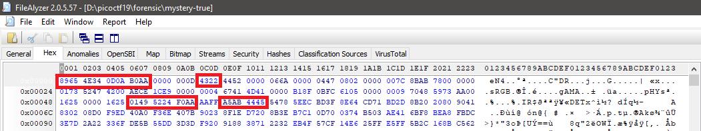
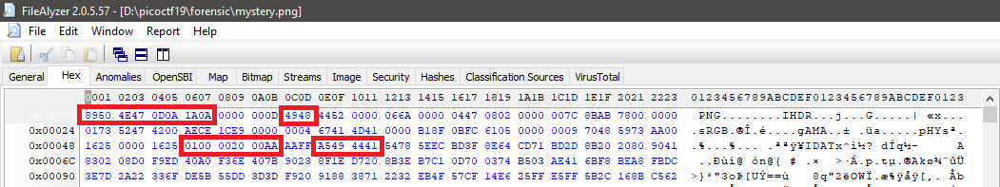

<h1 align="center">Forensics</h1>


<h3>shark on wire 1 - Points: 150</h3>
We found this packet capture. Recover the flag. You can also find the file in /problems/shark-on-wire-1_0_13d709ec13952807e477ba1b5404e620.

``` shell
Response:
Wireshark filter udp.port==8888 and see ip 10.0.0.12
Fragment of flag letter by letter.

Flag: picoCTF{StaT31355_636f6e6e}
``` 


<h3>WhitePages - Points: 250</h3>
I stopped using YellowPages and moved onto WhitePages... but the page they gave me is all blank!                                                                                                                                                                                                                                                                                                                                                                                                                                                                                                                                                                                                                                                                                                                                                                                                                                                                                                                                                                                                                                                                                                                                                                                                                                                                                                                                                                                                                      

``` shell
Response:
In sublimetext, I can see space and dot.
In notepad++, I can see space and square.
 
Convert to binary:

00001010000010010000100101110000011010010110001101101111010000110101010001000110000010100000101000001001000010010101001101000101010001010010000001010000010101010100001001001100010010010100001100100000010100100100010101000011010011110101001001000100010100110010000000100110001000000100001001000001010000110100101101000111010100100100111101010101010011100100010000100000010100100100010101010000010011110101001001010100000010100000100100001001001101010011000000110000001100000010000001000110011011110111001001100010011001010111001100100000010000010111011001100101001011000010000001010000011010010111010001110100011100110110001001110101011100100110011101101000001011000010000001010000010000010010000000110001001101010011001000110001001100110000101000001001000010010111000001101001011000110110111101000011010101000100011001111011011011100110111101110100010111110110000101101100011011000101111101110011011100000110000101100011011001010111001101011111011000010111001001100101010111110110001101110010011001010110000101110100011001010110010001011111011001010111000101110101011000010110110001011111011001100011000000110000001101100110001100110000001101000011010101100110001101100110001000110100001100000011001001100011011001010011010001100010011000110011011100110100001110010110010001100011001101110110000100110010001101100011001000110011001110000011000001111101000010100000100100001001

picoCTF

		SEE PUBLIC RECORDS & BACKGROUND REPORT
		5000 Forbes Ave, Pittsburgh, PA 15213
		picoCTF{not_all_spaces_are_created_equal_f006c045f6b402ce4bc749dc7a262380}

Flag: picoCTF{not_all_spaces_are_created_equal_f006c045f6b402ce4bc749dc7a262380}
``` 


<h3>c0rrupt - Points: 250</h3>
We found this file. Recover the flag. You can also find the file in /problems/c0rrupt_0_1fcad1344c25a122a00721e4af86de13.


``` shell
Modify header, chunk IDAT and CRC.
``` 
<p align="center"></p>

<p align="center"></p>

<p align="center"></p>

``` shell
Flag: picoCTF{c0rrupt10n_1847995}
``` 


<h3>like1000 - Points: 250</h3>
This .tar file got tarred alot. Also available at /problems/like1000_0_369bbdba2af17750ddf10cc415672f1c.

``` shell
Flag: picoCTF{}
``` 


<h3>m00nwalk - Points: 250</h3>
Decode this message from the moon. You can also find the file in /problems/m00nwalk_4_bcf65d52e5462dd0b70c0e984d7d5015.

``` shell
Flag: picoCTF{}
``` 


<h3>m00nwalk2 - Points: 300</h3>
Revisit the last transmission. We think this transmission contains a hidden message. There are also some clues clue 1, clue 2, clue 3. You can also find the files in /problems/m00nwalk2_1_ee6747feaad7bc16aa5ca2743ecd9652.

``` shell
Flag: picoCTF{}
``` 


<p align="left"><a href="https://github.com/Ne0Lux-C1Ph3r/WRITE-UP/blob/master/picoCTF2019/index.md">Return to the main menu</a></p>


