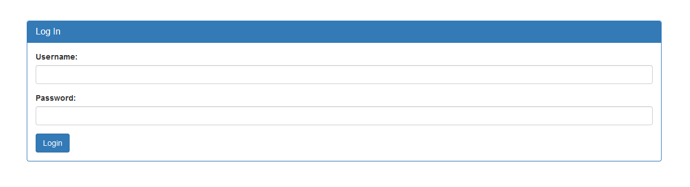
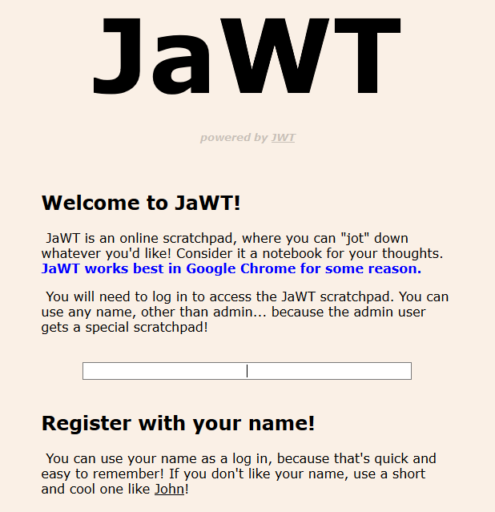

<h1 align="center">Web Exploitation</h1>


<h3>Irish-Name-Repo 1 - Points: 300</h3>
There is a website running at https://2019shell1.picoctf.com/problem/4162/ (link) or http://2019shell1.picoctf.com:4162. Do you think you can log us in? Try to see if you can login!

<p align="center"></img></p>

``` shell
Flag: picoCTF{}
```


<h3>Irish-Name-Repo 2 - Points: 350</h3>
There is a website running at https://2019shell1.picoctf.com/problem/14912/ (link). Someone has bypassed the login before, and now it's being strengthened. Try to see if you can still login! or http://2019shell1.picoctf.com:14912.

<p align="center"></img></p>

``` shell
Flag: picoCTF{}
```


<h3>Irish-Name-Repo 3 - Points: 400</h3>
There is a secure website running at https://2019shell1.picoctf.com/problem/12271/ (link) or http://2019shell1.picoctf.com:12271. Try to see if you can login as admin!

<p align="center"></img></p>

``` shell
Flag: picoCTF{}
```


<h3>JaWT Scratchpad - Points: 400</h3>
Check the admin scratchpad! https://2019shell1.picoctf.com/problem/45158/ or http://2019shell1.picoctf.com:45158

<p align="center"></img></p>

``` shell
Flag: picoCTF{}
```
